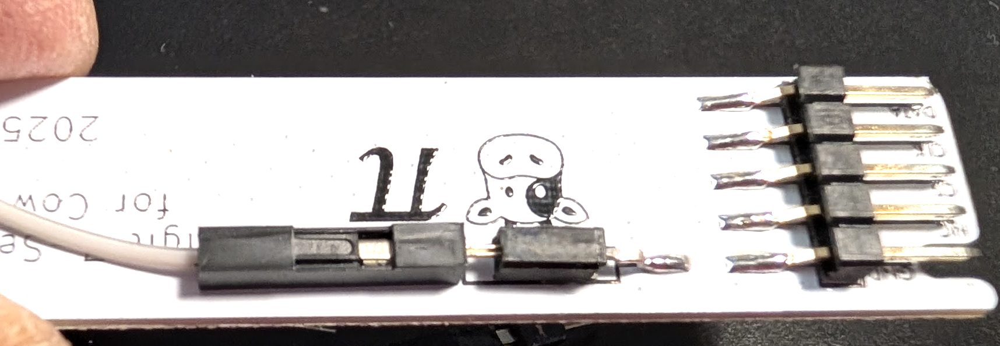

## Appendix B: Attaching and Detaching the Seven-Segment Display Module

### Attach the Seven-Segment Display Module to the Cow Pi

- [ ] Disconnect the Cow Pi from your computer.
- [ ] The seven-segment display module has a **PWR** socket on its underside. Insert one end of a jumper wire into the PWR socket.
   
- [ ] From above, most of the display module's pins are hidden.
  Notice that the end of the display module is labeled **SPI**.
  Position the display module near the sockets that have **SPI** secondary labels.
  The display module has a notch; through the notch you can see the **GND** pin.
  Align the GND pin with the **GND** socket that is between the SPI sockets and the I2C sockets.
   
- [ ] Slide the display module's pins into the SPI and GND sockets.
  Insert the other end of the jumper wire into a 5V socket.
   

<!--

-->

### Disconnecting the Seven-Segment Display Module from the Cow Pi

- [ ] Disconnect the Cow Pi from your computer.
- [ ] Disconnect the display module's power wire from the Cow Pi.
- [ ] Remove the display module from the Cow Pi.
- [ ] Optionally, disconnect the power wire from the display module.

---

|            [⬅️](AA-checkoff.md)            |      [⬆️](../README.md)      |                            |
|:------------------------------------------:|:----------------------------:|:--------------------------:|
| [Appendix A: Lab Checkoff](AA-checkoff.md) | [Front Matter](../README.md) |                            |

