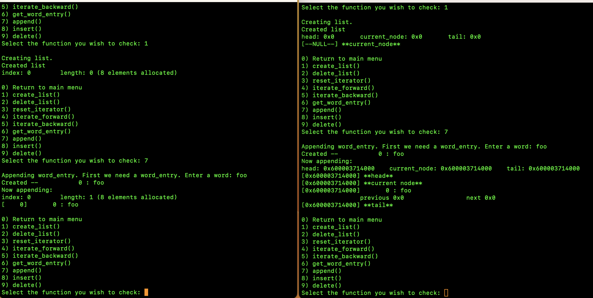

## Linked List Overview

> 💡 **Tip**
> 
> If you need a refresher on linked lists, see [this assignment's Appendix B](BB-data-structure.md).

### Definitions

In *list.h*, we use a forward declaration to make the code in *sorted_word_entries.c* aware of the types.

```c
typedef struct list_definition list_t;
typedef struct iterator_definition iterator_t;
```

When you built the *arraylist* executable earlier, the *array_list.h* file provided type definitions for the code in *array_list.c* to use.
Similarly, when you build the *linkedlist* executable, the *linked_list.h* file provides type definitions for the code in *linked_list.c* to use.

```c
struct list_definition {
    node_t *head;
    node_t *tail;
    iterator_t *iterator;
};

struct iterator_definition {
    list_t *list;
    node_t *current_node;
};
```

The list definition has three pointers, a `head` that points to the first node in the list, a `tail` that points to the last node in the list, and an `iterator`.
The iterator definition has two pointers, a `list` that points back to the list structure, and a `current_node` that points to the current node, denoting the iterator's position in the list.
<font color="red">
- `head` and `tail` are `nullptr` if and only if the list is empty.
- `current_node` only needs to have a sensible assignment when the iterator is valid.
  When the iterator is invalid, `current_node` can be `nullptr`; it can point to a node in the list; it can point to *any* memory location.
</font>

We define a linked list node conventionally:

```c
typedef struct node_definition node_t;

struct node_definition {
    word_entry_t *word_entry;
    node_t *next;
    node_t *previous;
};
```

> ⓘ **Note**
>
> Here the forward declaration is necessary so that `node_t` can be used when defining the node structure.

When writing functions in *sorted_word_entries.c*, you had to rely on `list_t`'s and `iterator_t`'s encapsulation and could not assume any particular list & iterator definitions.
**Whenever you are writing a function in *linked_list.c*, you can treat `list_t` and `iterator_t` as though they have the linked list definitions.**

### Building and Testing Your Linked List Implementation

If you use the command
```shell
cmake --build build
```
<!--
or \\
\verb+make all "OPTION=-DHOBBLE"+ \\
-->
then you will generate two executables: *arraylist* that has the array-backed list, and *linkedlist* that has the linked list.
If you open two terminal windows, you can run the test code on *arraylist* in one window and run the test suite on *linkedlist* in the other window.
This will allow you to compare the results with your linked list implementation against the expected results provided by the array-backed list:

<!--  -->
<figure>
    
    <figcaption>Testing an array-backed list (left) and a linked list (right) side-by-side.</figcaption>
</figure>

To test your linked list implementation, run *build/linkedlist* (and, optionally, *build/arraylist* in another terminal window),
and select option 2, "Test list"

---

|       [⬅️](06-inserting-words.md)        |      [⬆️](../README.md)      |              [➡️](08-create-and-attach-node.md)               |
|:----------------------------------------:|:----------------------------:|:-------------------------------------------------------------:|
| [Inserting Words](06-inserting-words.md) | [Front Matter](../README.md) | [Creating and Attaching a Node](08-create-and-attach-node.md) |
