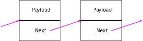
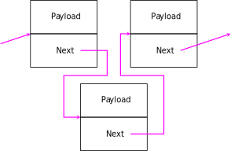
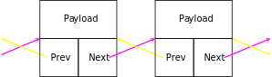

## Appendix B: Linked List

You probably learned about linked lists in \cstwo; however, we will provide a refresher.

A *linked list* is a linear collection of data.
Like an array, each element (or *node*) has a particular position in the list, and when you iterate over the list, you always access the elements in the same order every time (unless you change or re-order the elements).

In an array, the elements are contiguous in memory, and you can access a specific element by indexing the array (or, equivalently, performing pointer arithmetic).
In a linked list, however, the nodes can be in arbitrary locations in memory, and the nodes are connected by references (in C, pointers).
You can access a specific element only by following pointers from one node to the next until you reach the desired node.

### Singly-Linked List

The simplest linked list is a *singly-linked list*.
A node consists of a *payload* (the data that we care about) and a reference to the *next* node:



A linked list's greatest advantage over an array is that inserting and removing a node at an arbitrary location takes constant time, whereas inserting an element into an array (assuming there is sufficient memory allocated for the array) or removing an element from an array requires moving all the elements that follow the element's index.
Inserting a new node, $C$, between adjacent nodes $A$ and $B$ (where $B = A.next$) requires connecting $C.next$ to $B$ and re-assigning $A.next$ to $C$:



As with an array, you do need to maintain a variable that points to the list.
Conventionally, this is a reference to the *head* of the list.
(Note that if a new node is inserted before the current head node, then the new node becomes the head of the list, and your `head` variable would need to be updated.)
It is not uncommon to also maintain a reference to the *tail* of the list.

### Doubly-Linked List

A *doubly-linked list* is a linked list with the property that each node maintains a link not only to the `next` node but also a link to the `previous` node.
In C, these links are pointers.



Inserting new node, $C$, between adjacent nodes $A$ and $B$ (where $B = A.next$ and $A = B.previous$) requires connecting $C.previous$ to $A$ and $C.next$ to $B$, and re-assigning $A.next$ to $C$ and $B.previous$ to $C$.

### Equivalent Java Code

In Java, you probably wouldn't implement your own linked list;
instead, you would use `java.util.LinkedList`, which has been available since J2SE~1.2.
A list of `WordEntry` objects would be created with:
```java
List<WordEntry> wordEntries = new LinkedList<>;
```

C doesn't have a built-in linked list data type, so you will need to design one.
Let us consider what a custom linked list would look like in Java.

```java
public class WordEntry {
    private final String word;
    private int occurrences;
    …
}
```

```java
public class Node {
    private final WordEntry wordEntry;
    private Node next;
    private Node previous;

    public Node(WordEntry wordEntry) {
        …
    }
    …
}
```

```java
public class MyIterator {
    private MyLinkedList list;
    private Node currentNode;

    public MyLinkedList insert(WordEntry wordEntry) {
        Node node = new Node(wordEntry) {
        …
    }
    …
}
```

```java
public class MyLinkedList {
    private Node head;
    private Note tail;
    private Node current;

    public MyIterator append(WordEntry wordEntry) {
        Node node = new Node(wordEntry) {
        …
    }
    …
}
```

Creating and inserting a new word entry would look something like this:

```java
    iterator = list.append(new WordEntry("eggplant"));
    while (...) iterator.swapPrevious(); // determine where new node goes
    if (...) iterator.merge();           // no duplicate word entries allowed
```

Recall that in Java, all variables except primitive types (such as `occurrences`) are references.
This means that the `next` field is a reference to another Node, just as we described in [the section discussing singly-linked lists](#singly-linked-list).
The payload is the `wordEntry`.

### C Implementation

In *linked-list.h*, you'll see `struct`s fields similar to our Java example
(we've placed the pointer to the current node in an iterator to make the mental model for some of the operations more explicit):

```c
struct node_definition {
    word_entry_t *word_entry;
    node_t *next;
    node_t *previous;
};
```

```c
struct list_definition {
    node_t *head;
    node_t *tail;
    iterator_t *iterator;
};
```

```c
struct iterator_definition {
    list_t *list;
    node_t *current_node;
};
```

In *linked-list.c*, you'll also see the `create_node()` and `create_list()` functions:

```c
static node_t *create_node(word_entry_t *word_entry) {
    node_t *node = malloc(sizeof(node_t));
    /* INITIALIZE NODE */

    return node;
}
```

```c
list_t *create_list(void) {
    list_t *word_list = malloc(sizeof(list_t));
    /* INITIALIZE WORD_LIST */

    return word_list;
}
```

As you can see, they allocate space for a new node or a new list handle using `malloc()`.
The code that you will need to add to `create_node()` will copy the `word_entry` argument into the `word_entry` field.
Since we don't yet know where this node will go, set the node's `next` and `previous` pointers to point to `nullptr`.
The code that you will need to add to `create_list()` is even simpler: a newly-created list is empty, and so it has no head, no tail, and no current node.


### A Visualization of the Data Types

#### word_entry_t


#### node_t


#### list_t as an array-backed list


#### list_t as a linked list


---

|                                                [⬅️](AA-JavaVsC.md)                                                |      [⬆️](../README.md)      |              [➡️](CC-word-tables.md)               |
|:-----------------------------------------------------------------------------------------------------------------:|:----------------------------:|:--------------------------------------------------:|
| [Appendix A: Differences and Similarities between Java and C that are Relevant to this Assignment](AA-JavaVsC.md) | [Front Matter](../README.md) | [Appendix C: Word Count Tables](CC-word-tables.md) |
