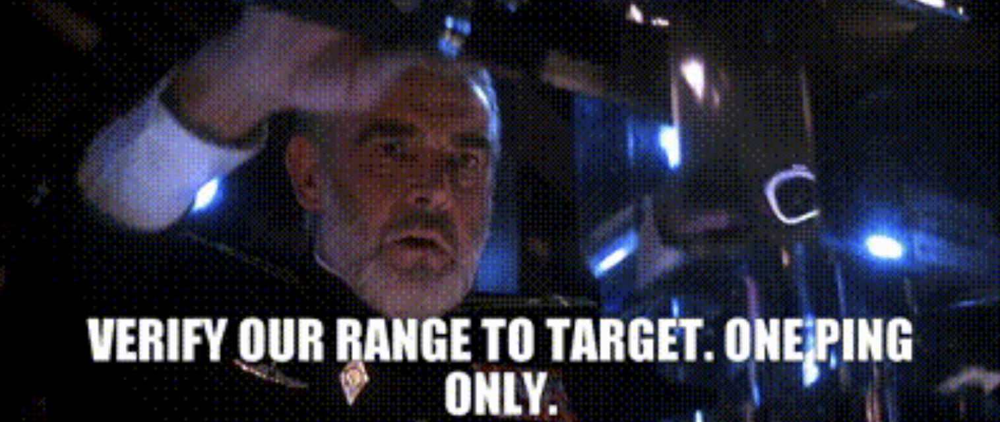

## Building the Sensor's State Machine

In this part of the assignment, you will prepare the sensor state machine so that the press of a button will cause the rangefinder to emit one ultrasonic pulse and to listen for the echo.

<figcaption>Verify our range to Target. One ping only. <small>Image by Paramount Pictures Corporation</small></figcaption>

### Initiate a pulse

The `manage_sensor()` function runs in the program's main control loop.
When you examine it, you'll see that it has an input state machines for the left pushbutton.
Notice that when the right pushbutton responds to a press, it calls the `initiate_pulse` function.

- [ ] In the `initiate_pulse()` function, add code that, if `sensor_state` is `READY`:
  - [ ] First, set the `TRIGGER_PIN` pin to logic-high
  - [ ] Then, busy-wait for 10µs
  - [ ] Finally, set the `TRIGGER_PIN` pin to logic-low

> 💡 **Tip**
>
> Use `set_pin_high()` and `set_pin_low()`.

Several microseconds later, the sensor will emit its ultrasound pulse and raise its `ECHO_PIN` line to logic-high.

### Handle the Start of a Pulse

- In the `on_pulse_edge()` function:
  - [ ] Determine if the interrupt was fired due to the rising edge or falling edge of the pulse.
  
    > 💡 **Tip**
    >
    > Use `read_pin()`.

  - [ ] Add code that, if the interrupt is due to the rising edge and `sensor_state` is `READY`:
    - [ ] First, call `reset_periodic_timer(SENSOR_TIMER)` so that the next timer interrupt will fire 32,768µs from "now".
    - [ ] Then, store the current time in `pulse_start_time`.

      > 💡 **Tip**
      >
      > Use `get_microseconds()`.

    - [ ] Finally, transition the sensor's state machine into `ACTIVE_LISTENING`. 

Two things will happen in the next 38 (or fewer) milliseconds: the signal on the `ECHO_PIN` pin will fall to logic-low, and the sensor timer will fire an interrupt.
Whichever happens first, the signal falling low or the timer interrupt, will tell us whether there's an object.

### Handle the End of a Pulse

If the signal on the `ECHO_PIN` pin falls to logic-low first, then it's because there's an object that reflected the ultrasound pulse.
If the pin interrupt was fired for a falling edge, and if the sensor is "active-listening," then you want to capture the information needed to compute the distance.

- [ ] Add code to `on_pulse_edge` that, if the interrupt is due to a falling edge and the `sensor_state` is `ACTIVE_LISTENING`:
  - [ ] First, store the current time in `pulse_end_time`.
  - [ ] Then, transition the sensor's state machine into `ACTIVE_DETECTED`.

### Handle the Timer Interrupt

If the sensor timer interrupt fires before the signal on the `ECHO_PIN` pin falls low, then there is not an object within detectable range.
The sensor will time-out after 36,000--38,000µs, and the sensor timer will fire an interrupt after 32,768µs.
Any object whose echo might have been detected after this must be beyond the sensor's detection range.

If the sensor is "active-listening" then no object was detected.

- [ ] Add code to `handle_sensor_timer()` that, if `sensor_state` is `ACTIVE_LISTENING`:
  - [ ] First, set `object_detected` to `false`
  - [ ] Then, transition the sensor's state machine into `QUIESCENT`.

On the other hand, if the sensor is "active-detected" then an object was detected.

- [ ] Add code to `handle_sensor_timer()` that, if `sensor_state` is `ACTIVE_DETECTED`:
  - [ ] First, set `object_detected` to `true`
  - [ ] Then, transition the sensor's state machine into `QUIESCENT`.

As [noted earlier](05-distance.md#theory-of-operation), the sensor requires quiescent period between pulses.

- [ ] Add code to `handle_sensor_timer()` that, if `sensor_state` is `QUIESCENT`, transitions the sensor's state machine into `READY`.

### Check Your Work So Far

Notice that `manage_sensor()` also includes a call to `process_detection()`.
Since the sensor it's listening for objects while it's quiescent, we can process what we know during the quiescent period without racing against a possible detection. 

- [ ] Add code to `process_detection()` that, if `sensor_state` is `QUIESCENT`, places a short message on the display's $0^{th}$ row that indicates whether or not an object was detected.
  Be sure to limit the message to no more than 16 characters.

  > 💡 **Tip**
  >
  > Use `display_string()`.

- [ ] [Attach the Distance Sensor Module to the Cow Pi](BB-peripherals.md#attach-the-distance-sensor-module-to-the-cow-pi).
- [ ] Place the Cow&nbsp;Pi's **right** switch in the *left* position, and the **left** switch in the *right* position.
  Compile and upload the program to the Cow Pi.
- [ ] Orient the Cow&nbsp;Pi so that the sensor points to a nearby object, and press the **left** pushbutton.
  Confirm that the display indicates that an object was detected.
- [ ] Orient the Cow&nbsp;Pi so that the sensor does not point to any nearby objects, such as down a hall or into an empty part of a large room, , and press the **left** pushbutton.
  It may require few attempts if the room isn't empty, but confirm that the display indicates that no object was detected.

  
### Compute and Display the Distance

- [ ] Modify your code in `process_detection()` so that, when `sensor_state` is `QUIESCENT` and `object_detected` is `true`:
  - [ ] Compute the pulse duration from `pulse_start_time` and `pulse_end_time`.
  - [ ] Read the value from the temperature register.

    > 💡 **Tip**
    >
    > Use `read_temperature_register()`.

  - [ ] Call `compute_distance()` to get the object's distance in centimeters.
  - [ ] Report the distance on the display's $0^{th}$ row.
- [ ] Be sure that your code in `process_detection()` still indicates that no object was detected when `sensor_state` is `QUIESCENT` and `object_detected` is `false`.

- [ ] Add code to `compute_distance()` to compute the distance to the object using the [correct equation](05-distance.md#the-equation), and return that value.

- [ ] Place the Cow&nbsp;Pi's **right** switch in the *left* position, and the **left** switch in the *right* position.
  Compile and upload the program to the Cow Pi.
- [ ] Orient the Cow&nbsp;Pi so that the sensor points to a nearby object, and press the **left** pushbutton.
  Confirm that the display shows the distance to the object.
- [ ] Change the distance to the object, and press the **left** pushbutton.
  Confirm that the display shows the new distance to the object.
- [ ] Orient the Cow&nbsp;Pi so that the sensor does not point to any nearby objects, such as down a hall or into an empty part of a large room, , and press the **left** pushbutton.
  It may require few attempts if the room isn't empty, but confirm that the display indicates that no object was detected.

---

|                 [⬅️](05-distance.md)                  |      [⬆️](../README.md)      |        [➡️](07-proximity-alarm.md)         |
|:-----------------------------------------------------:|:----------------------------:|:------------------------------------------:|
| [Measuring the Distance to an Object](05-distance.md) | [Front Matter](../README.md) | [A Proximity Alarm](07-proximity-alarm.md) |
