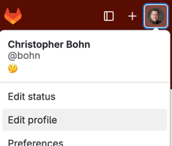
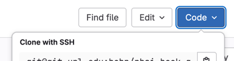

# Setting Up Your CSCE 231 Development Environment

## Your Account on git.unl.edu

We will distribute the assignment documents and starter code to a Git repository that we are providing to you.
We will collect your completed assignments from those same repository.

If you have not already done so, create an account on [git.unl.edu](https://git.unl.edu).
- [ ] Navigate a web browser to [git.unl.edu](https://git.unl.edu).
- [ ] Sign-in under "University of Nebraska - Lincoln" (*not* "University of Nebraska").
  - If you accidentally sign in under the wrong institution, you can get back to the original menu by clearing browser cookies from the domain incommonfederation.org.
  - If you see a message that your account is blocked, click on the "Request Service" button [on this page](https://nusupport.nebraska.edu/TDClient/33/Portal/Requests/ServiceDet?ID=77) and let the TAs know *immediately*.
- [ ] Open the [git.unl.edu username](https://canvas.unl.edu/courses/200913/assignments/2093960) Canvas assignment and enter your username in the text entry field.

After you have submitted your git.unl.edu username, a TA will assign to you one of the Git repositories that already has the assignment and starter code for the code portion of this week's assignment.
They will place the URL in a comment in the "git.unl.edu username" Canvas assignment and mark the Canvas assignment as "Complete".

There are other setup actions you can take while you wait for the TAs.

> ⚠️ **Important**
> 
> If you ever need a refresher on how to use Git, do not hesitate to ask a TA or the professor for help!  
> CodeHelp.app also has a context for Git that you can use (though a human can more easily look over your shoulder as they guide you).

### Git Configuration

#### Prepare an SSH keypair

If you have not already prepared an SSH keypair to authenticate with git.unl.edu from nuros.unl.edu:
- [ ] Log into nuros.unl.edu (see the [discussion below](#the-development-environment))
- [ ] Run the command
  ```
  ssh-keygen -t rsa -b 4096 -C "CSCE 231"
  ```
  When asked what file to save it in, press ENTER to accept the default.  
  When prompted for a passphrase, you may set one up, or you can press ENTER to use no passphrase.
- [ ] Run the command
  ```
  cat ~/.ssh/id_rsa.pub
  ```
- [ ] Highlight the output, and copy it to your computer's clipboard.
- [ ] In git.unl.edu's web interface, click on your avatar to get a drop-down menu, and select "Edit profile" (alternatively, from your account page, there is an "Edit profile" in the upper-right corner)
  
- [ ] In the left-side menu, select "SSH Keys".
- [ ] Paste the public key that you copied into the "Key" field, and click "Add key"

#### Configure your Git identity

If you have not already configured your Git identity on nuros.unl.edu:
- [ ] Run these commands:
  ```
  git config --global user.name "YOUR HUMAN NAME"
  git config --global user.email "USERNAME@huskers.unl.edu"
  ```
  Where *YOUR HUMAN NAME* is your name, such as *Stuart Dent*, and *USERNAME* is your huskers.unl.edu username.

---

## The Development Environment

For most of the semester, the target platform will be the nuros.unl.edu Linux server.
You have the option of writing your software on your personal computer and then uploading it to Nuros for testing,
but IDE's remote development tools have matured enough that most students find it more convenient to configure their IDE for remote development on Nuros.
That is, your files will be in your home directory on Nuros; your IDE will connect to your Nuros account to access the files; building and testing the files will take place on Nuros automatically.

### Secure Shell Terminal

You can reasonably expect that when you're using your IDE for remote development, its built-in terminal emulator will also connect to Nuros.
There will be a couple of labs that may be easier to use a more conventional terminal emulator to SSH into Nuros.

#### From Mac or Linux

If your personal computer (or the lab computer you're using) is a Mac or a Linux box, 
the simplest option is to open a terminal window on your computer and type
```
ssh USERNAME@nuros.unl.edu
```
where *username* is your UNL username.
See the "Working Remotely" section of [The School of Computing's Support FAQ](https://computing.unl.edu/faq/), 
specifically "Connecting to cse.unl.edu and other Unix servers with SSH from...", for instructions.

-  Instead of using *cse.unl.edu* has the Host Name, use *nuros.unl.edu*.
-  Instead of using your SoC username and password, use your UNL username and password.

#### From Windows

If your personal computer (or the lab computer you're using) is a Windows machine,
you can launch an SSH session from a Windows terminal window in the same manner as for Mac and Linux, though this seems to be a less-popular option than using PuTTY.

If you choose to use PuTTY, see the "Working Remotely" section of [The School of Computing's Support FAQ](https://computing.unl.edu/faq/),
specifically "Connecting to cse.unl.edu and other Unix servers with SSH from Windows" for instructions.

-  Instead of using *cse.unl.edu* has the Host Name, use *nuros.unl.edu*.
-  Instead of using your SoC username and password, use your UNL username and password.

### Transferring Files

If you do your development remotely, you shouldn't need to transfer files between your local computer and Nuros.
If you find that you do need to do so, you can reasonably expect that when you're using your IDE for remote development, you can drag-and-drop from the IDE's "files" pane to your local computer's file manager.
You may, however, prefer a standalone application to transfer files.

#### scp

If you're comfortable working with the command line, the `scp` command has very much the same basic use of the `cp` command, except that you specify the remote host.
Coping files from your computer to the server:
```
scp FILE-1 FILE-2 ... FILE-N USERNAME@nuros.unl.edu:FILEPATH
```
copies the files from your local computer to the *filepath* on the *nuros.unl.edu* Linux server, where *filepath* is relative to your home directory.
Or, working the other direction:
```
scp USERNAME@nuros.unl.edu:FILE FILEPATH
```
copies *file* from the remote server to *filepath on your local computer.
Just as with *cp*, you can use the `-r` argument to copy directories:
```
scp -r pokerlab USERNAME@nuros.unl.edu:.
scp -r USERNAME@nuros.unl.edu:pokerlab .
```

#### FileZilla

FileZilla is a very popular drag-and-drop option.
See the "Working Remotely" section of [The School of Computing's Support FAQ](https://computing.unl.edu/faq/),
specifically "How do I access my home directory from off campus from Windows?"
(Despite the name of that particular FAQ, FileZilla is also available for non-Windows systems.)

-  Instead of using *cse.unl.edu* has the Host Name, use *nuros.unl.edu*.
-  Instead of using your SoC username and password, use your UNL username and password.

### Editing Files

#### Vim or Emacs

If you prefer to use Vim or Emacs, we assume that you will either work from the command line on Nuros and are otherwise sufficiently comfortable with your editor that you will need little guidance in configuring it.

#### VS Code

[VS Code](https://code.visualstudio.com/) is a very popular IDE.
You will need to install some plugins:
- [ ] [C/C++ Extension Pack](https://marketplace.visualstudio.com/items?itemName=ms-vscode.cpptools-extension-pack), which includes
  - C/C++ <!-- https://marketplace.visualstudio.com/items?itemName=ms-vscode.cpptools -->
  - CMake Tools <!-- https://marketplace.visualstudio.com/items?itemName=ms-vscode.cmake-tools -->
  - C/C++ UI Themes <!-- https://marketplace.visualstudio.com/items?itemName=ms-vscode.cpptools-themes -->
- [ ] [Remote - SSH](https://marketplace.visualstudio.com/items?itemName=ms-vscode-remote.remote-ssh)
- [ ] [PlatformIO](https://marketplace.visualstudio.com/items?itemName=platformio.platformio-ide)

<!--

[//]: # (TODO: It looks like this will require some server-level downloads, and sysadmin might not appreciate that. CLion will have to wait until we switch to Docker)

#### CLion

[CLion](https://www.jetbrains.com/clion/) is second in popularity only to VS Code; price may be a factor for that.
JetBrains has long offered a free academic license for its professional-grade products (that involved leaping through a few hoops),
but JetBrains recently made CLion free for any noncommercial use, which should greatly simplify the process if you wish to use CLion.
You will need to install a plugin:
- [ ] [PlatformIO](https://www.jetbrains.com/help/clion/platformio.html)

-->

#### Other IDEs

You may use another IDE if you wish; however, you are responsible for configuring it.

When we issue the Cow Pi hardware kits (or before that), you will want to install the [PlatformIO plugin](https://platformio.org/install/integration) for your IDE or the [command-line PlatformIO Core](https://platformio.org/install/cli).

---

## Clone Your Git Repository

After the TAs have placed the URL for your Git repository in the comments of the "git.unl.edu username" Canvas assignment,
navigate to that URL in your web browser to confirm that you have access.

- [ ] Locate the `Code ᵛ` button and click it to get its dropdown menu. Copy the "Clone with SSH" link.  
  
- [ ] Using a Secure Shell Terminal, connect to your account on nuros.unl.edu. Optionally create a directory for CSCE 231 and use `cd` to navigate to that directory.
- [ ] Clone your Git repository:
  ```
  git clone git@git.unl.edu:csce231/...
  ```
  where *git@git.unl.edu:csce231/...* is the "Clone with SSH" link that you copied.
- [ ] After the clone is complete, run these three commands:
  ```
  cat /etc/hostname
  whoami
  ls
  ```
- [ ] Open the [Connection to Nuros](https://canvas.unl.edu/courses/200913/assignments/2094033) Canvas assignment and copy the responses into the text entry field.

## Connect to the Starter Code and Start PokerLab

[//]: # (- [ ] In your IDE, connect to nuros.unl.edu for remote development.)
[//]: # (  The TAs can help you if you need help.)
[//]: # (  - VS Code: <!-- https://code.visualstudio.com/docs/remote/ssh -->)
[//]: # (    - [ ] Select **Remote-SSH: Connect to Host...** from the Command Palette.)
[//]: # (    - [ ] Use USERNAME@nuros.unl.edu)
[//]: # (    - [ ] After the connection is established, use **File** ⇒ **Open...** to navigate to PokerLab.)
[//]: # (      - Navigate to the directory that has the *README.md* file and the *CMakeLists.txt* file.)
[//]: # (  - CLion: <!-- https://www.jetbrains.com/help/clion/2025.2/remote-development-a.html?remote.development.launch.gateway#launch_gateway -->)
[//]: # (    - From the Welcome Screen:)
[//]: # (      - [ ] )
[//]: # (    - If you already have a project open:)
[//]: # (      - [ ] Select **File** ⇒ **Remote Development...**)
[//]: # (      - [ ] In the "Remote Development" window, under "Remote Development", create a new SSH Connection by clicking the "New Connection" button.)
[//]: # (        - After you have the connection configured, you can access it from "SSH" under "Connections")
[//]: # (    - [ ] )

- [ ] In your VS Code (or your preferred IDE), connect to nuros.unl.edu for remote development.
  - Select **Remote-SSH: Connect to Host...** from the Command Palette.
  - Use USERNAME@nuros.unl.edu
  - After the connection is established, use **File** ⇒ **Open...** to navigate to PokerLab.
    - Navigate to the directory that has the *README.md* file and the *CMakeLists.txt* file.
- [ ] Open *README.md*
  - Option 1: Open *README.md* in the web interface for your Git repository
  - Option 2: In VS Code's "Explorer" pane, right-click on *README.md* and select **Open Preview**

The *README.md* file contains the PokerLab assignment's frontmatter, and you can navigate from there to the rest of the assignment.

The *src/* directory contains the PokerLab starter code.

- [ ] Complete the PokerLab assignment.
