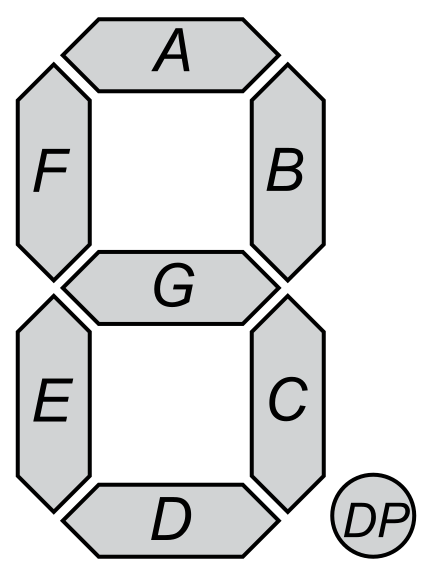
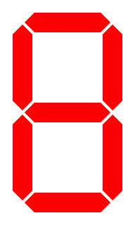

## Seven-Segment Display

### About

Seven-segment displays are so-called because they form glyphs by placing each of seven segments in "on" or "off"
positions.
The astute observer will note that there is an eighth segment, a dot.
Seven-segment displays were created primarily to represent numbers, and the dot serves as a decimal point.
With a little creativity, other recognizable characters can be displayed using only the seven segments (and possibly the
decimal point),
though segmented displays with more segments are appropriate if being able to read words easily is important.

The seven segments used to form a digit are named A through G, and the decimal point segment is named DP.

[//]: # (![A diagram suggestive of a seven-segment display, with the segments labeled &#40;clockwise, from the top&#41; A, B, C, D, E, and F; the central segment is labeled G; and the dot is labeled DP.]&#40;images/seven_segment/labeled_segments.svg&#41;)

### Truth Table

The truth table for a seven-segment display depicting decimal numerals 0 through 9 is:

|                          numeral                           | segment A | segment B | segment C | segment D | segment E | segment F | segment G |
|:----------------------------------------------------------:|:---------:|:---------:|:---------:|:---------:|:---------:|:---------:|:---------:|
|  |     1     |     1     |     1     |     1     |     1     |     1     |     0     |
|  |     0     |     1     |     1     |     0     |     0     |     0     |     0     |
|  |     1     |     1     |     0     |     1     |     1     |     0     |     1     |
|  |     1     |     1     |     1     |     1     |     0     |     0     |     1     |
|  |     0     |     1     |     1     |     0     |     0     |     1     |     1     |
|  |     1     |     0     |     1     |     1     |     0     |     1     |     1     |
|  |     1     |     0     |     1     |     1     |     1     |     1     |     1     |
|  |     1     |     1     |     1     |     0     |     0     |     0     |     0     |
|  |     1     |     1     |     1     |     1     |     1     |     1     |     1     |
|  |     1     |     1     |     1     |     1     |     0     |     1     |     1     |

---

|       [⬅️](01-getting-started.md)        |      [⬆️](../README.md)      |          [➡️](03-digital-logic-design.md)          |
|:----------------------------------------:|:----------------------------:|:--------------------------------------------------:|
| [Getting Started](01-getting-started.md) | [Front Matter](../README.md) | [Digital Logic Design](03-digital-logic-design.md) |

---

### SVG credits

- Public Domain
    - 0.svg https://en.wikipedia.org/wiki/File:7-segment_abcdef.svg
    - 1.svg https://en.wikipedia.org/wiki/File:7-segment_bc.svg
    - 2.svg https://en.wikipedia.org/wiki/File:7-segment_abdeg.svg
    - 3.svg https://en.wikipedia.org/wiki/File:7-segment_abcdg.svg
    - 4.svg https://en.wikipedia.org/wiki/File:7-segment_bcfg.svg
    - 5.svg https://en.wikipedia.org/wiki/File:7-segment_acdfg.svg
    - 6.svg https://en.wikipedia.org/wiki/File:7-segment_acdefg.svg
    - 7.svg https://en.wikipedia.org/wiki/File:7-segment_abc.svg
    - 8.svg https://en.wikipedia.org/wiki/File:7-segment_abcdefg.svg
    - 9.svg https://en.wikipedia.org/wiki/File:7-segment_abcdfg.svg
- CC0
    - labeled_segments.svg https://commons.wikimedia.org/wiki/File:7_Segment_Display_with_Labeled_Segments.svg

