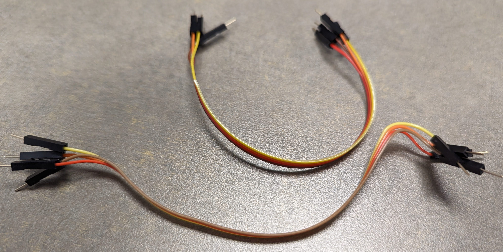
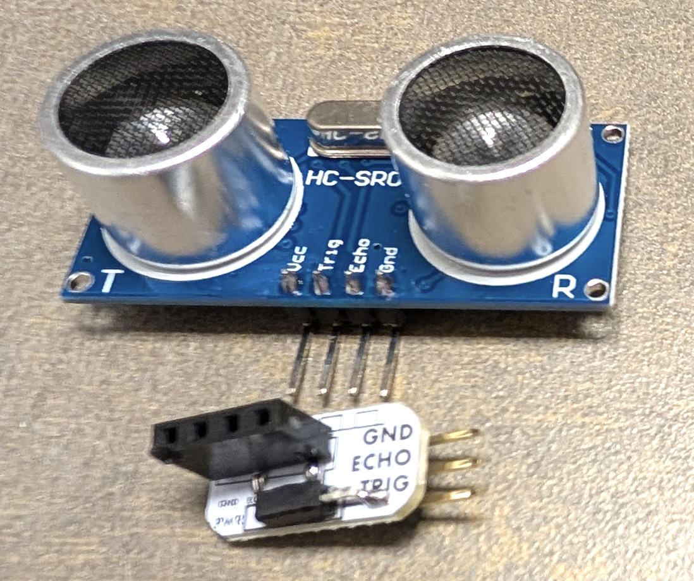
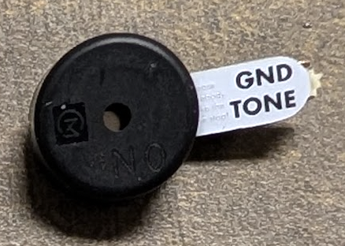
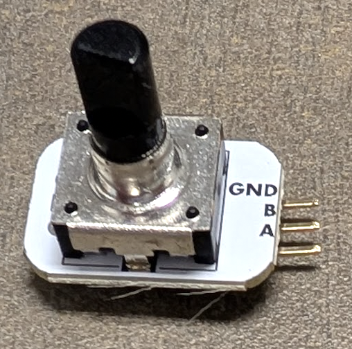
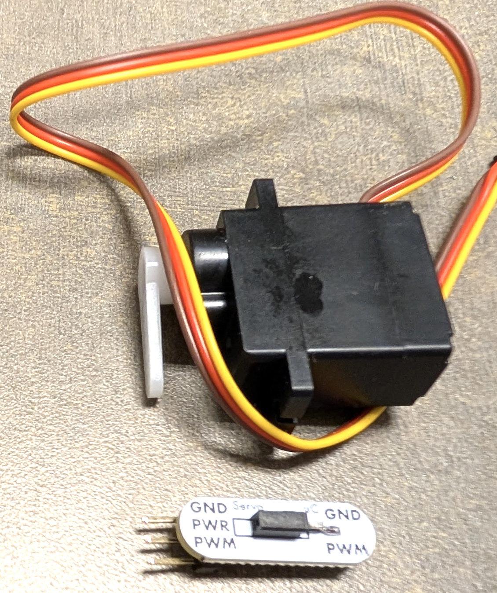
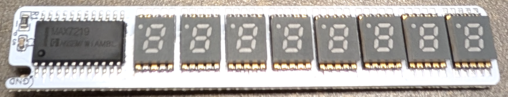

## Inventory the Hardware Kit

In this pre-lab, you will inventory the contents of the hardware kit that you were issued.

**If you are missing one or more items, visit Avery 27 to obtain a replacement part.**

> 📝 **Grading Note**
> 
> To receive credit for completing the inventory, you will need to complete [the assignment on Canvas](https://canvas.unl.edu/courses/209782/assignments/2190103).

### Inventory the Kit

Make sure that you have:

- [ ] A Cow&nbsp;Pi development board 
    
- [ ] A USB cable 
    
- [ ] 4 jumper wires (might be individual wires, or might be in strands that can have wires peeled off) 
    
- [ ] An ultrasonic distance sensor with adapter 
    
- [ ] A piezobuzzer module 
    
- [ ] A rotary encoder module 
    
- [ ] A servomotor with adapter 
    
- [ ] A 7-segment display module 
    

### Statement of Understanding

You understand that:

- [ ] You are required to return the hardware kit with all of its components no later than the end of lab time in the final week of the semester.
- [ ] You must return the components in good condition. 
    You are not responsible for normal wear-and-tear;
    however, you will be held responsible for lost items and for damage due to neglect or malice.

> 📝 **Grading Note**
>
> To receive credit for completing the inventory, you will need to complete [the assignment on Canvas](https://canvas.unl.edu/courses/209782/assignments/2190103).

---

|                 |      [⬆️](../README.md)      |           [➡️](02-control-panel.md)           |
|:---------------:|:----------------------------:|:---------------------------------------------:|
|                 | [Front Matter](../README.md) | [Test the Control Panel](02-control-panel.md) |
