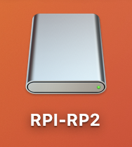
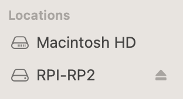
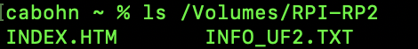
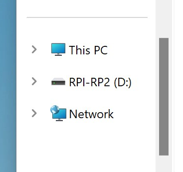

## Test the Control Panel

In this pre-lab, you will learn how to upload a program to the Cow Pi, and you will confirm that the Cow Pi board itself is functioning.

> 📝 **Grading Note**
>
> To receive credit for Prelab 2, you will need to complete [the assignment on Canvas](https://canvas.unl.edu/courses/209782/assignments/2190104).


### Connect to the Cow Pi

Using the USB cable included in the Cow Pi kit, connect your computer to the Cow Pi.
After you do so, it will start running the last program that had been loaded.

- [ ] Connect the micro-USB end to the Cow Pi
- [ ] Connect the USB-C end to your computer


### Activate the Bootloader

Activating the bootloader requires a specific sequence of actions:

1. **Press the RESET button**, located between the white breadboard and the green Raspberry Pi Pico 
2. While still pressing the RESET button, **press the BOOTSEL button** on the Raspberry Pi Pico
3. **Release the RESET button**
4. **Release the BOOTSEL button**

This will cause a USB mass storage device named RPI-RP2 to be mounted on your computer.

- On macOS:
  - RPI-RP2 will appear on your desktop<br>
    
  - You can see it in the "Finder"<br>
    
  - You can access it through the command line<br>
    
- On Windows:
  - RPI-RP2 will be available in the "File Explorer"<br>
    

If you can open the USB mass storage device on your computer, continue with the prelab

If you cannot open the USB mass storage device on your computer, log into a lab computer (in the SRC, Avery 15, Avery 20, or Avery 21) and repeat the steps on the lab computer.


### Upload the Program

- [ ] Locate the *prelab2.uf2* file in the [build/](../build) directory.
- [ ] Option 1: Drag & drop *prelab2.uf2* into the mass storage device.
  - As soon as the file has been copied to the flash storage,
    the microcontroller will disconnect the USB mass storage device 
    (and your operating system will likely warn you that you disconnected the device without unmounting it first).<br>
  - [Watch demo video](images/uploading-firmware/drag%20to%20cowpi.mp4)
- [ ] Option 2: Use the command line:
  ```shell
  cp build/prelab2.uf2 /Volumes/RPI-RP2/
  ```


### Green Blinky of Death

When there's a segmentation fault, the green LED on the Raspberry Pi Pico will blink four short blinks, four long blinks, four short blinks, four long blinks, and so on.
- [Watch demo video](images/uploading-firmware/GreenBlinkyOfDeath.mp4)

There is a race condition that will sometimes cause a segmentation fault in the first few milliseconds of a program running.
We currently believe this is in the initialization routines of the MBED OS core.

**If you encounter the Green Blinky of Death, press and release the RESET button.**
If that doesn't work, press the RESET button again.
And again if need be.
Perhaps one more time.


### What You Will See

The Cow Pi logo will appear on the display for two seconds, and then you will see some text.

```
Keypad:
----------------

Switches: L L
Buttons: UP UP

20251016/1209 XX
```

Except for the bottom row, the display will provide you with information about the buttons and switches on the Cow Pi.

- When you press a key on the keypad, one of the dashes will be replaced with the character that corresponds to the key. When you release the key, the dash returns.
- The "Switches" row shows the position of each of the two switches (Left or Right)
- The "Buttons" row shows whether each of the buttons is pressed down (DN) or released (UP)
- If the left switch is in the right position and the left button is pushed, then the left LED will illuminate. Similarly, if the right switch is in the right position and the right button is pushed, then the right LED will illuminate.

The bottom row has the day/time that the program was compiled and a "liveness counter".


### Test the Cow Pi's Controls

- [ ] Test each of the 16 keys on the keypad
- [ ] Test each of the two buttons
- [ ] Test each of the two switches
- [ ] Test each of the two LEDs


### Prelab 2 Complete

If everything worked, you have finished Prelab 2.

If something didn't work, consult a TA or Dr.&nbsp;Bohn to double-check.

If the TA or Dr.&nbsp;Bohn confirms that the Cow&nbsp;Pi doesn't work, visit Avery 27 to exchange it for another Cow&nbsp;Pi.


> 📝 **Grading Note**
>
> To receive credit for Prelab 2, you will need to complete [the assignment on Canvas](https://canvas.unl.edu/courses/209782/assignments/2190104).


---

|             [⬅️](01-inventory.md)             |      [⬆️](../README.md)      |          [➡️](03-piezobuzzer.md)          |
|:---------------------------------------------:|:----------------------------:|:-----------------------------------------:|
| [Inventory the Hardware Kit](01-inventory.md) | [Front Matter](../README.md) | [Test the Piezobuzzer](03-piezobuzzer.md) |
