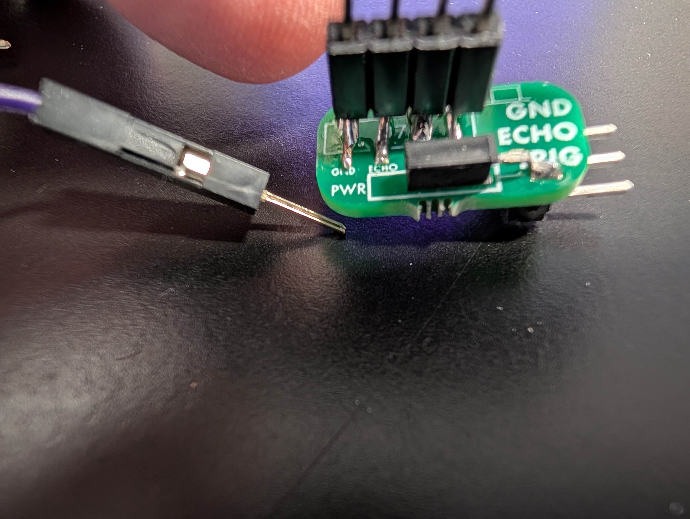
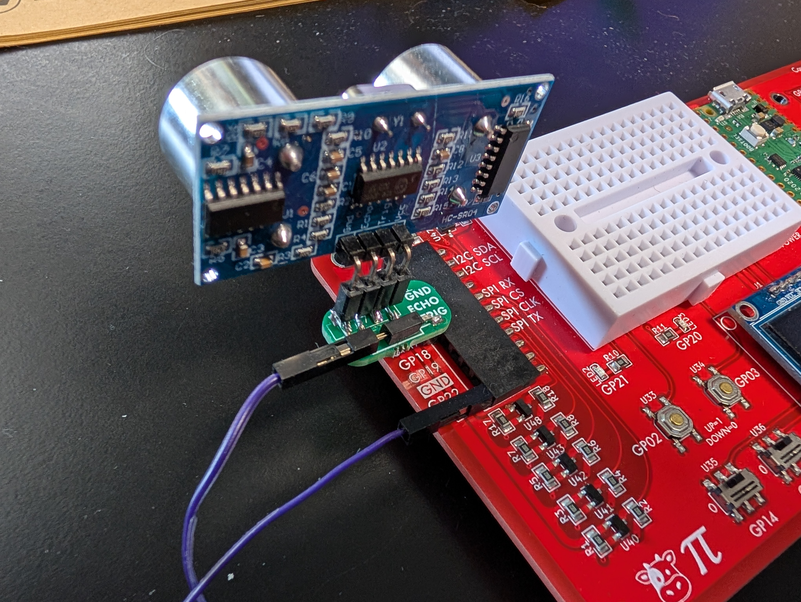

## Test the Distance Sensor

> ❗️ **Important**
>
> If you have not already completed Prelabs 2-4, please complete Prelabs 2-4 first!

In this pre-lab, you will learn how to connect a powered peripheral to the Cow Pi, and you will confirm that the distance sensor and its adapter are functioning.

> 📝 **Grading Note**
>
> To receive credit for Prelab 5, you will need to complete [the assignment on Canvas](https://canvas.unl.edu/courses/209782/assignments/2190107).


### Attach the Distance Sensor to its Adapter

*If your distance sensor is already attached to its adapter, you can skip this step.*

Observe that the distance sensor has four pins.
The adapter has a socket designed to receive four pins.
Next to this socket is a stylized representation of the distance sensor with its two acoustic shrouds.
<br>
Insert the sensor's four pins into the 4-hole socket in the orientation indicated by the diagram on the adapter.
<br>


### Attach the Distance Sensor Module to the Cow Pi

- [ ] Disconnect the Cow Pi from your computer.
- [ ] The adapter has a second socket, labeled **PWR**.<br>
  <br>
  Insert one end of a jumper wire into the PWR socket.<br>
  
- [ ] Hold the distance sensor module next to the sockets on the left-side of the Cow Pi, aligning the adapter's **TRIG** pin with the Cow Pi's **GP17**, the adapter's **ECHO** pin with the Cow Pi's **GP16**, and the adapter's **GND** pin with the **GND** socket adjacent to GP16.<br>
  
- [ ] Slide the distance sensor adapter's pins into the GP17, GP16, and GND sockets.<br>
  
- [ ] The left side of the Cow Pi has two sockets labeled **5V**.<br>
  
- [ ] Insert the other end of the jumper wire into one of the 5V sockets.<br>
  


### Activate the Bootloader

Activating the bootloader requires a specific sequence of actions:

1. Press the RESET button, located between the white breadboard and the green Raspberry Pi Pico
2. While still pressing the RESET button, press the BOOTSEL button on the Raspberry Pi Pico
3. Release the RESET button
4. Release the BOOTSEL button

Drag & drop *prelab5.uf2* from the [build/](../build) directory into the mass storage device.


### What You Will See

The Cow&nbsp;Pi's display will show:

```
echo        XXXX us
```
indicating the round-trip time for an ultrasonic pulse to echo off of a nearby object back to the sensor. If there isn't a nearby object, you will see

```
--no detection--
```
If you place your hand in front of the sensor, you will see the echo message.


### Prelab 5 Complete

If everything worked, you have finished Prelab 5.

If something didn't work, consult a TA or Dr.&nbsp;Bohn to double-check.

If the TA or Dr.&nbsp;Bohn confirms that the distance sensor and/or the adapter doesn't work, visit Avery 27 to exchange it for another Cow&nbsp;Pi.


### Disconnecting the Distance Sensor Module from the Cow Pi

- [ ] Disconnect the Cow Pi from your computer.
- [ ] Disconnect the distance sensor's power wire from the Cow Pi.
- [ ] Remove the distance sensor adapter from the Cow Pi.
  - We recommend that you leave the distance sensor connected to its adapter.
- [ ] Optionally, disconnect the power wire from the adapter.


> 📝 **Grading Note**
>
> To receive credit for Prelab 5, you will need to complete [the assignment on Canvas](https://canvas.unl.edu/courses/209782/assignments/2190107).


---

|           [⬅️](04-rotary-encoder.md)            |      [⬆️](../README.md)      |       [➡️](06-servo.md)       | 
|:-----------------------------------------------:|:----------------------------:|:-----------------------------:| 
| [Test the Rotary Encoder](04-rotary-encoder.md) | [Front Matter](../README.md) | [Test the Servo](06-servo.md) | 
