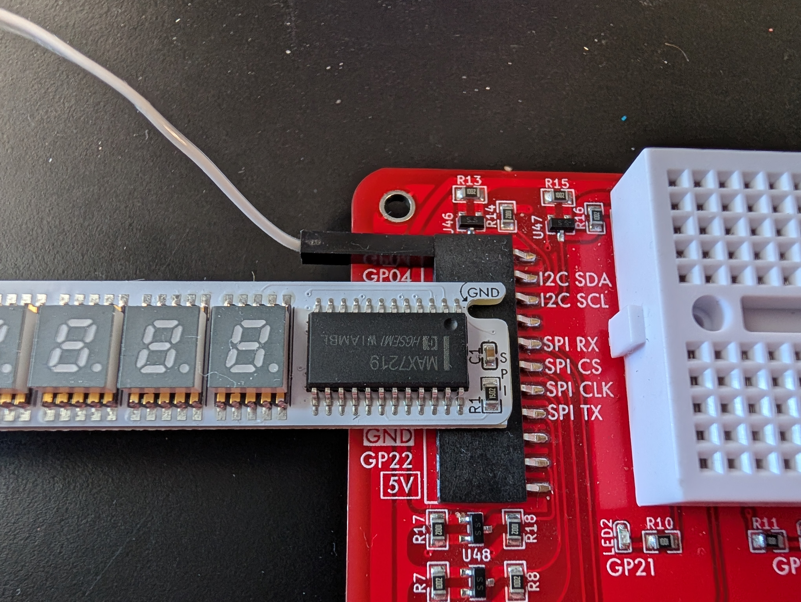

## Test the Seven-Segment Display

> ❗️ **Important**
>
> If you have not already completed Prelab 5, please complete Prelab 5 first!

In this pre-lab, you will confirm that the servo and its adapter are functioning.

> 📝 **Grading Note**
>
> To receive credit for Prelab 7, you will need to complete [the assignment on Canvas](https://canvas.unl.edu/courses/209782/assignments/2190109).


### Attach the Seven-Segment Display Module to the Cow Pi

- [ ] Disconnect the Cow Pi from your computer.
- [ ] The seven-segment display module has a **PWR** socket on its underside. Insert one end of a jumper wire into the PWR socket.<br>
  
- [ ] From above, most of the display module's pins are hidden.
  Notice that the end of the display module is labeled **SPI**.
  Position the display module near the sockets that have **SPI** secondary labels.
  The display module has a notch; through the notch you can see the **GND** pin.
  Align the GND pin with the **GND** socket that is between the SPI sockets and the I2C sockets.<br>
  
- [ ] Slide the display module's pins into the SPI and GND sockets.
  Insert the other end of the jumper wire into a 5V socket.<br>
  


### Activate the Bootloader

Activating the bootloader requires a specific sequence of actions:

1. Press the RESET button, located between the white breadboard and the green Raspberry Pi Pico
2. While still pressing the RESET button, press the BOOTSEL button on the Raspberry Pi Pico
3. Release the RESET button
4. Release the BOOTSEL button

Drag & drop *prelab7.uf2* from the [build/](../build) directory into the mass storage device.


### What You Will See

Both the 7-segment display module and the Cow&nbsp;Pi's display will alternate between displaying
```
Hello
```
and
```
  World!
```

### Prelab 6 Complete

If everything worked, you have finished Prelab 7.

If something didn't work, consult a TA or Dr.&nbsp;Bohn to double-check.

If the TA or Dr.&nbsp;Bohn confirms that the display module doesn't work, visit Avery 27 to exchange it for another Cow&nbsp;Pi.


### Disconnecting the Seven-Segment Display Module from the Cow Pi

- [ ] Disconnect the Cow Pi from your computer.
- [ ] Disconnect the display module's power wire from the Cow Pi.
- [ ] Remove the display module from the Cow Pi.
- [ ] Optionally, disconnect the power wire from the display module.


> 📝 **Grading Note**
>
> To receive credit for Prelab 7, you will need to complete [the assignment on Canvas](https://canvas.unl.edu/courses/209782/assignments/2190109).


---

|       [⬅️](06-servo.md)       |      [⬆️](../README.md)      |        [➡️](08-compile-program.md)         |
|:-----------------------------:|:----------------------------:|:------------------------------------------:|
| [Test the Servo](06-servo.md) | [Front Matter](../README.md) | [Compile a Program](08-compile-program.md) |
