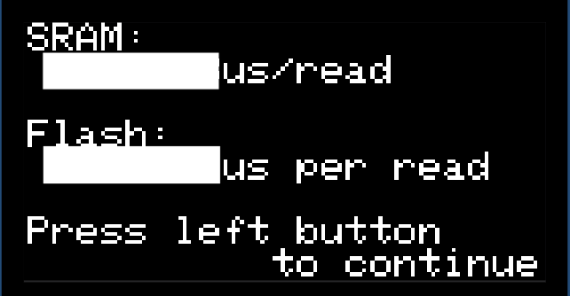

## Measuring Memory Speed

In *memory_measurement.c* you'll find three functions, `time_register_access()`, `time_sram_access()`, and `time_flash_access()`.
Each of functions repeatedly adds a value to a variable.
In `time_register_access()`, the values are in registers:

```c
    start = get_microseconds();
    sum += a0;
    sum += a1;
    sum += a2;
    sum += a3;
    stop = get_microseconds();
    register_access_time += (stop - start);
```

compiles to

```asm
    bl      get_microseconds
    movs    r5, r0
    add     r4, r4, r10
    add     r4, r4, r9
    add     r4, r4, r8
    adds    r4, r4, r7
    bl      get_microseconds
```

In the `time_sram_access()` and `time_flash_access()` functions, the values are in memory:

```c
    unsigned long volatile *p = array + j;
    start = get_microseconds();
    sum += *p;
    sum += *(p + 8);
    sum += *(p + 16);
    sum += *(p + 24);
    stop = get_microseconds();
    sram_access_time += (stop - start);
```

compiles to

```asm
    bl      get_microseconds
    movs    r6, r0
    ldr     r3, [r4]
    adds    r3, r7, r3
    ldr     r2, [r4, #32]
    adds    r3, r3, r2
    ldr     r2, [r4, #64]
    adds    r3, r3, r2
    ldr     r7, [r4, #96]
    adds    r7, r3, r7
    bl      get_microseconds
```

Thus, by subtracting the execution time for a function whose values are in memory from the execution time for the function whose values are in registers,
we will have the amount of time spent loading values from memory.
In `time_sram_access()`, the array is at an arbitrary location in data memory.
In `time_flash_access()`, the array is at one of the addresses that map to the flash instruction memory;
its particular address is one that bypasses the cache and will always read directly from the flash memory.


- [ ] Press the **1** key on the numeric keypad (*Memory access time*).


A screen with the time to access each of the memories will be displayed:



[//]: # (- [ ] Answer questions 1-6 in *answers.txt*.)
- [ ] Answer questions 1-6 in the Canvas assignment

  1. What is the microcontroller's clock period, in microseconds?
     - The RP2040's clock frequency is 133MHz, or 133 megacycles per second.
     - You can determine its period, in microseconds, by dividing $\frac{1}{133}$.

  2. What is the reported time required to access data in SRAM?
     - Copy the value from the output in the display.

  3. Is the reported time required to access data in SRAM consistent with information in the Cortex-M0+ Technical Reference Manual?
     Explain why or why not.
     - The [Instruction Set Summary in ARM's Cortex-M0+ Technical Reference Manual](https://developer.arm.com/documentation/ddi0484/c/Programmers-Model/Instruction-set-summary)
       states that the `ldr` instruction will take two clock cycles to read from SRAM.

  4. What is the reported time required to access data in flash memory?
     - Copy the value from the output in the display.

  5. How many clock cycles are required to access data in flash memory?
     - Do the math.

  6. What can you conclude about the relative speeds of SRAM and flash memory?
     - Is the difference important?
     - Is the instruction cache necessary, or is it just "nice to have"?
     - Justify your conclusion with the data you collected.

- [ ] Press the left pushbutton to return to the main menu.


---

|          [⬅️](02-start-the-program.md)           |      [⬆️](../README.md)      |               [➡️](04-cache-size.md)                |
|:------------------------------------------------:|:----------------------------:|:---------------------------------------------------:|
| [Launching the Program](02-start-the-program.md) | [Front Matter](../README.md) | [Measuring the Size of the Cache](04-cache-size.md) |
