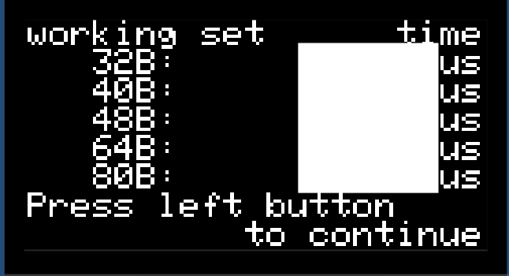
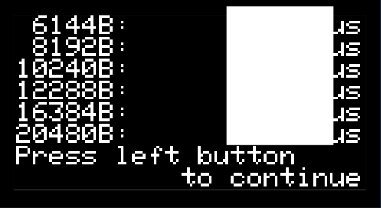

## Measuring the Size of the Cache

One of the functions in *cache_measurement.c* is `measure_cache_size()`.
This function, with the assistance of a helper function, iterates over an "array" that  is at one of the addresses that map to the flash instruction memory;
its particular address is one that uses the cache.
On a cache hit, the value is read from the cache's SRAM;
on a cache miss, the value is retrieved from flash memory, and the corresponding block is placed in the cache.

While the first access to the array's elements will probably be misses,
by repeatedly reading from the array, we expect that most accesses will be hits.
Until the size of the "array" is too great to fit into the cache, that is.
When that happens, we will thrash the cache, causing all (or nearly all) accesses to be misses.

The `measure_cache_size()` will increase the size of the "array" until it is too great to fit into the cache.
The program will measure how much CPU time your process spends accessing the data.
We are less concerned with the specific amount of time, as we are with when the program stops being "fast."
(This is a subjective inference, but the data you collect from the RP2040 for this part of the lab won't be subtle.)

Here we show a graph similar to the one you will produce.
The figure shows the cache size measurements for an Intel Core i7 processor in a 2018 MacBook Pro.
This particular processor has a 32KB L1 data cache (also a 32KB L1 instruction cache), a 256KB L2 cache, and a 2MB L3 cache.
There are labels showing where these limits are exceeded -- other measurement artifacts make it difficult to discern the limit of the L1 cache, but we can use the chart to reasonably estimate the sizes of the L2 and L3 caches with an error less than a factor of 2.

The main differences between that chart and the chart you'll produce are:
- The RP2040 has only one cache level
- There is less competition for the cache on the RP2040

When taking measurements on the Intel Core i7 processor, the data can be "mushy" because there are other processes using the processor, which will also use the cache.
On the RP2040, the only competition for the cache will be the program's instructions which will occasionally conflict with the "data" we're reading,
and the occasional interrupt by MBED&nbsp;OS\@.

- [ ] Press the **2** key on the numeric keypad (*Cache size*).

A screen with the time to access each of the memories will be displayed:

- [ ] Open the "Data" tab in *CacheCharts.xlsx* and locate the portion labeled "CACHE SIZE".
- [ ] Copy the times reported for working sets sized 32--80 bytes into the spreadsheet's cells B2--B6.
- [ ] Press the left button to advance to the next page of data.

- [ ] Repeatedly copy the times reported into the appropriate cells in the spreadsheet, using the left pushbutton to advance through the pages.
- [ ] When you have finished, use the left pushbutton to return to the main menu.
- [ ] Open the "Cache Size" tab.
<!--
- [ ] Answer question 7 in *answers.txt*.
  7. What is your estimate for the size of the RP2040's cache?
     - The maximum size for which the program runs "fast" is the size of the cache.
-->
- [ ] Take a screenshot of the "Cache Size" tab and paste it into the answer for question 7 in the Canvas assignment.
- [ ] Answer question 8 in the Canvas assignment.
  8. What is your estimate for the size of the RP2040's cache?
      - The maximum size for which the program runs "fast" is the size of the cache.

---

|           [⬅️](03-memory-speed.md)           |      [⬆️](../README.md)      |                 [➡️](05-cache-line.md)                 |
|:--------------------------------------------:|:----------------------------:|:------------------------------------------------------:|
| [Measuring Memory Speed](03-memory-speed.md) | [Front Matter](../README.md) | [Measuring the Size of a Cache Line](05-cache-line.md) |
