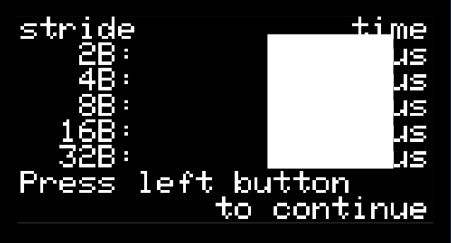

## Measuring the Size of a Cache Line

One of the functions in *cache_measurement.c* is `measure_cache_line_by_time()`.
As with `measure_cache_size()`, this function iterates over an "array" in flash memory that can be cached.
Where `measure_cache_size()` held the stride constant and grew the array's size,
`measure_cache_line_by_time()` holds the array's size constant and grows the stride.

Recall that caches are designed to take advantage of locality, and when memory access patterns don't take advantage of locality then performance suffers.
We will exploit this fact by increasing the access stride so that you can notice when there is a slight increase in timing due to the stride exceeding the length of a cache line.
When the stride is shorter than the size of a cache line, then some accesses will be cache misses, but those misses will bring a new block into the cache.
Subsequent accesses to the same block will be cache hits.
When the stride is equal to (or greater than) the size of a cache line, then each access will be in a different block,
and every access will be a cache miss.

Here we show a graph similar to the one you will produce.
The time measured by the program holds more-or-less steady up through strides of 32 bytes.
When the stride reaches 64 bytes, there is a noticeable increase in the measured time.
From this, we can conclude that the Intel Core i7's cache line is 64 bytes.

As with the earlier cache measurement, you might see some interference from MBED&nbsp;OS;
if the data doesn't seem to make sense, feel free to re-run the test.

- [ ] Press the **3** key on the numeric keypad (*Cache line size*).

A screen with the time to access each of the memories will be displayed:

- [ ] Open the "Data" tab in *CacheCharts.xlsx* and locate the portion labeled "STRIDE".
- [ ] Copy the times reported for strides of 2--32 bytes into the spreadsheet's cells B40--B44.
- [ ] Press the left button to advance to the next page of data.

- [ ] Copy the times reported for strides of 64--512 bytes into the spreadsheet's cells B45--B48.
- [ ] Press the left button to advance to the next page of data.
- [ ] Open the "Cache Line Size infer by time" tab.
<!--
- [ ] Answer question 8 in *answers.txt*.
  8. What is your estimate for the size of a cache line in the RP2040's cache?
     - The size at which there is a noticeable increase in time is the size of a cache line.
-->
- [ ] Take a screenshot of the "Cache Line Size infer by time" tab and paste it into the answer for question 9 in the Canvas assignment.
- [ ] Answer question 10 in the Canvas assignment.
  10. What is your estimate for the size of a cache line in the RP2040's cache?
      - The size at which there is a noticeable increase in time is the size of a cache line.

- [ ] Save *CacheCharts.xlsx*<!-- and *answers.txt*-->.

---

|               [⬅️](04-cache-size.md)                |      [⬆️](../README.md)      |         [➡️](06-grading.md)          |
|:---------------------------------------------------:|:----------------------------:|:------------------------------------:|
| [Measuring the Size of the Cache](04-cache-size.md) | [Front Matter](../README.md) | [Turn-In and Grading](06-grading.md) |
