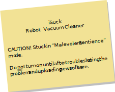

> 📇 **Post-Credits Scene**
>
> As an opportunity to stretch your legs, you decided to walk from your office at the Pleistocene Petting Zoo to Eclectic Electronics, to personally give Herb your memory measurement data.
> As you approach Eclectic Electronics' labs, you notice that the lights are flickering, and sparks are dripping from the ceiling.
> You see that a new Cow Pi-based electronic lock is still holding the lab door shut squarely in its frame -- 
> but the door frame has been torn from the wall and is laying askew in the hallway.
> On the floor is a Cow Pi-based calculator; 
> the display reads:
> ```
> Robot count:  12
>             -  1
> ```
> 
> Peeking into the lab, you see a platform, empty except for a note. The note says:
> 
> 
> 
> A Cow-Pi based motion alarm chirps as something enters its detection range.
>
> *Cut to black.*


## Turn-In and Grading

Be sure that you have pushed your data to git.unl.edu.

### Late Submissions

This assignment is due at the end of your lab section.
If you have late days available, you may use one or more to extend your deadline.
You can exercise a late day (or days) by editing the [LATE-DAYS-USED-ON-THIS-ASSIGNMENT.txt](../LATE-DAYS-USED-ON-THIS-ASSIGNMENT.txt) file and including the update with your code.

After you have exhausted your late days, we will accept late turn-ins up to one hour late, assessing a 10% penalty on these late submissions.
After you have exhausted your late days, any work turned in more than one hour late will not be graded.

### Rubric

This assignment is worth 10 points.

- [ ] **+1** Measuring the speed of SRAM and flash memory on the RP2040.
- [ ] **+2** Concluding whether or not the time to access data in SRAM is consistent with the Cortex-M0+ Technical Reference Manual, and justifying your conclusion.
- [ ] **+2** Drawing a reasonable conclusion about the speed of flash memory relative to the speed of SRAM.
- [ ] **+1** Measuring the cache size and the cache line size on the RP2040.
- [ ] **+2** Drawing a reasonable conclusion about the size of the RP2040's cache.
- [ ] **+2** Drawing a reasonable conclusion about the size of the RP2040's cache line.

Your conclusions do not need to be correct to receive full credit.
You can receive full credit if your conclusions are reasonable, given your measurements.


---

|                 [⬅️](05-cache-line.md)                 |      [⬆️](../README.md)      |                       |
|:------------------------------------------------------:|:----------------------------:|:---------------------:|
| [Measuring the Size of a Cache Line](05-cache-line.md) | [Front Matter](../README.md) |                       |
