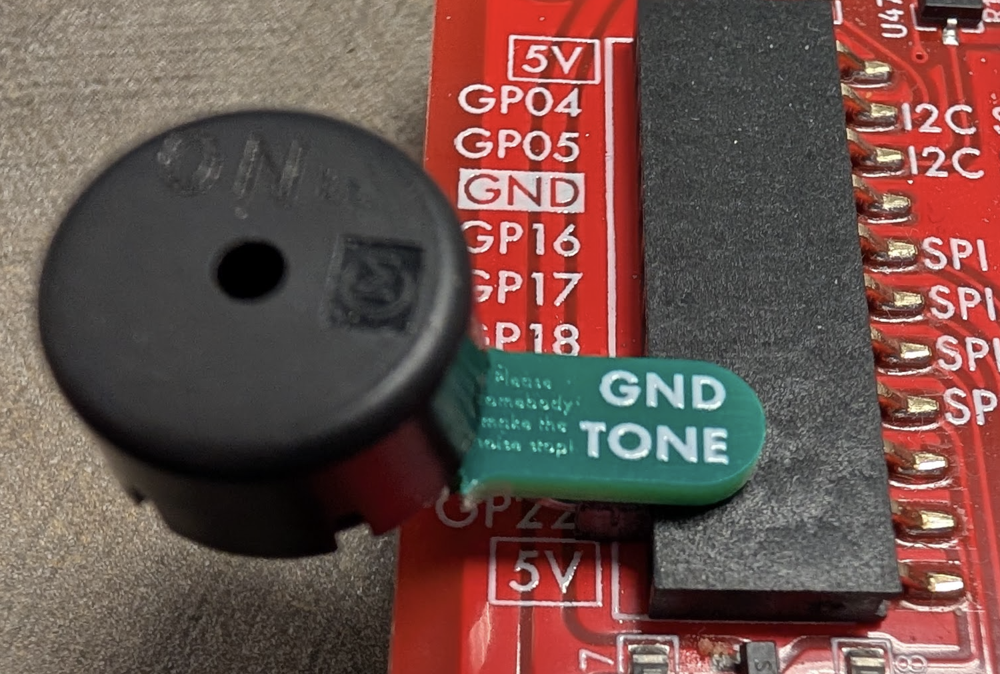
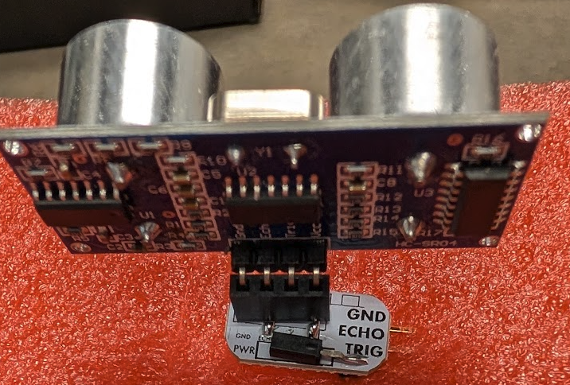
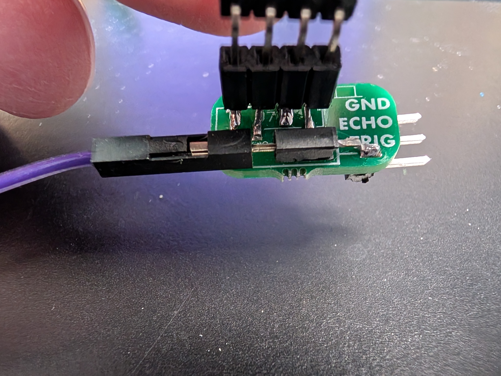

## Appendix B: Attaching and Detaching Peripheral Devices

### Attach the Piezobuzzer Module to the Cow Pi

- [ ] Disconnect the Cow Pi from your computer.
- [ ] Hold the piezobuzzer module next to the sockets on the left-side of the Cow Pi.
  Align the piezobuzzer module's **TONE** pin with the Cow Pi's **GP22**, and the piezobuzzer module's **GND** pin with the **GND** socket adjacent to GP22.
   
- [ ] Slide the piezobuzzer module's TONE and GND pins into the GP22 and GND sockets.
   

### Disconnecting the Piezobuzzer Module from the Cow Pi

- [ ] Disconnect the Cow Pi from your computer.
- [ ] Remove the piezobuzzer from the Cow Pi.

---

### Attach the Distance Sensor to its Adapter

*If your distance sensor is already attached to its adapter, you can skip this step.*

Observe that the distance sensor has four pins.
The adapter has a socket designed to receive four pins.
Next to this socket is a stylized representation of the distance sensor with its two acoustic shrouds.
 
Insert the sensor's four pins into the 4-hole socket in the orientation indicated by the diagram on the adapter.
 

### Attach the Distance Sensor Module to the Cow Pi

- [ ] Disconnect the Cow Pi from your computer.
- [ ] The adapter has a second socket, labeled **PWR**.
   
   Insert one end of a jumper wire into the PWR socket.
   
- [ ] Hold the distance sensor module next to the sockets on the left-side of the Cow Pi, aligning the adapter's **TRIG** pin with the Cow Pi's **GP17**, the adapter's **ECHO** pin with the Cow Pi's **GP16**, and the adapter's **GND** pin with the **GND** socket adjacent to GP16.
   
- [ ] Slide the distance sensor adapter's pins into the GP17, GP16, and GND sockets.
   
- [ ] The left side of the Cow Pi has two sockets labeled **5V**.
   
- [ ] Insert the other end of the jumper wire into one of the 5V sockets.
   

### Disconnecting the Distance Sensor Module from the Cow Pi

- [ ] Disconnect the Cow Pi from your computer.
- [ ] Disconnect the distance sensor's power wire from the Cow Pi.
- [ ] Remove the piezobuzzer from the Cow Pi.
- [ ] Optionally, disconnect the power wire from the adapter.

---

|            [⬅️](AA-checkoff.md)            |      [⬆️](../README.md)      |                                       [➡️](CC-distance-formulation.md)                                       |
|:------------------------------------------:|:----------------------------:|:------------------------------------------------------------------------------------------------------------:|
| [Appendix A: Lab Checkoff](AA-checkoff.md) | [Front Matter](../README.md) | [Appendix C: Re-Expressing the Distance Equation to use only Integer Arithmetic](CC-distance-formulation.md) |
