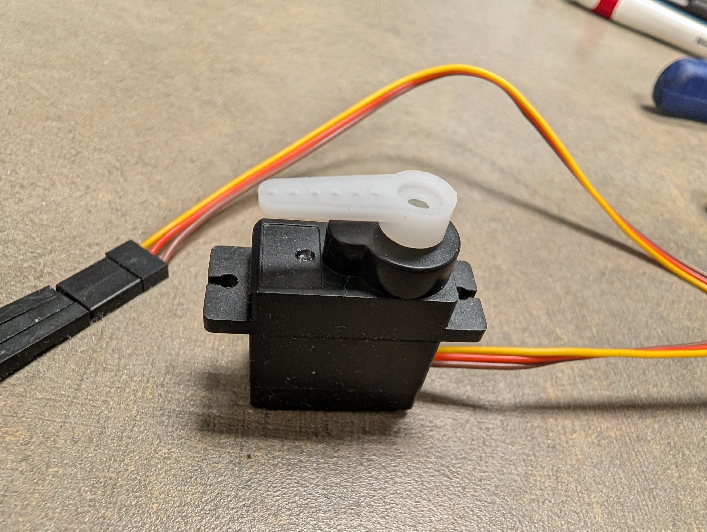
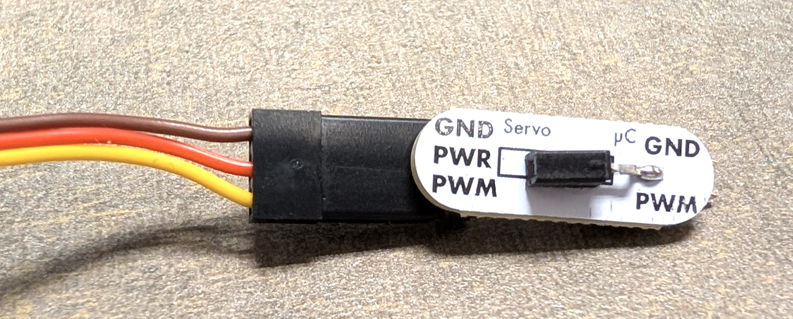
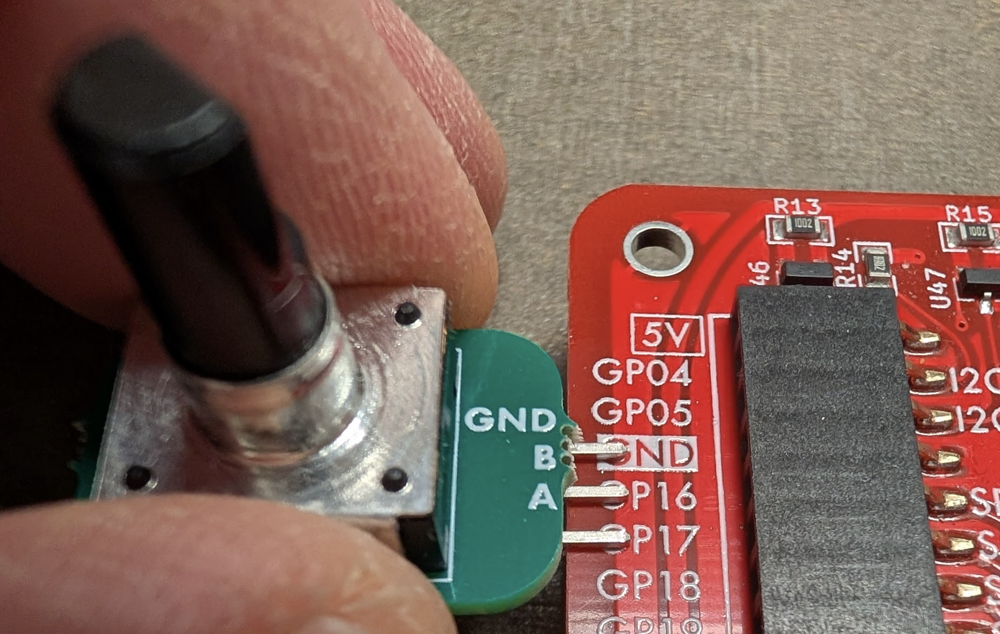
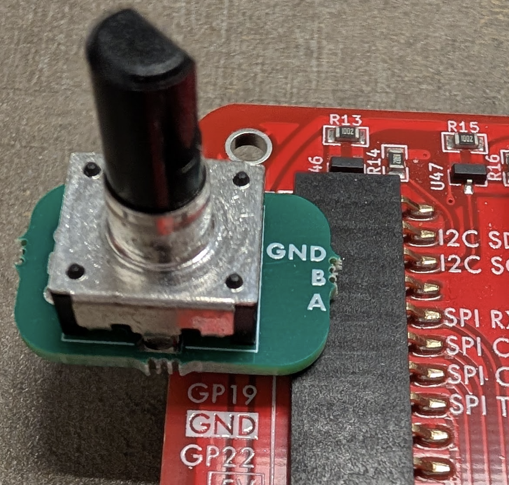

## Appendix B: Attaching and Detaching Peripheral Devices

### Attach the Servo Arm to the Servomotor 

*If your servomotor already has a servo arm attached, you can skip this step.*

- The servo consists of a nylon arm and a servomotor.
- [ ] Take one of the servo arms (for our purposes, it doesn't matter which one) and hold it over the servomotor's shaft (for our purposes, the axial orientation doesn't matter).
  One end of the arm's axis has toothed ridges to interconnect with the servomotor's shaft; 
  that end should be pointed toward the shaft.
   
- Press the arm onto the shaft.
   

We recommend that you do not use a screw to hold the servo arm to the servomotor. If you do use a screw, do not fully tighten it.

### Attach the Servo to its Adapter

*If your servo is already attached to its adapter, you can skip this step.*

- Observe that the servo's cable is designed to connect to three pins. 
- The adapter has three pins on the end labeled ***Servo*** and two pins on the end labeled ***µC*** ("microcontroller").
- [ ] Connect the servo's cable to the *Servo* end of the adapter, such that the **brown** wire is connected to the **GND** pin, and the **yellow** wire is connected to the **PWM** pin.
   

### Attach the Servo to the Cow Pi

Disconnect the Cow Pi from your computer.
After your Cow Pi is no longer powered-up:

- [ ] The adapter has a **PWR** socket.
  Insert one end of a jumper wire into the PWR socket.
- [ ] Hold the servo cable's adapter next to the sockets on the left-side of the Cow Pi, aligning the adapter's **PWM** pin with the Cow Pi's **GP22**, and the adapter's **GND** pin with the **GND** socket adjacent to GP22.such that the **brown** wire is connected to the **GND** pin, and the **yellow** wire is connected to the **PWM** pin.
   
- [ ] Slide the servo cable adapter's pins into the GP22 and GND sockets.
  Insert the other end of the jumper wire into a 5V socket.such that the **brown** wire is connected to the **GND** pin, and the **yellow** wire is connected to the **PWM** pin.
   

<!--
  
  
  
  
  
-->

### Disconnecting the Servo from the Cow Pi

- [ ] Disconnect the Cow Pi from your computer.
- [ ] Disconnect the servo adapter's power wire from the Cow Pi.
- [ ] Remove the servo adapter from the Cow Pi.
  - We recommend that you leave the servo connected to its adapter.
- [ ] Optionally, disconnect the power wire from the servo adapter.

---

### Attach the Rotary Encoder Module to the Cow Pi

- [ ] Disconnect the Cow Pi from your computer.
- [ ] Hold the rotary encoder module next to the sockets on the left-side of the Cow Pi.
- [ ] Align the rotary encoder module's **A** pin with the Cow Pi's **GP17**, the rotary encoder module's **B** pin with the Cow Pi's **GP16**, and the rotary encoder module's **GND** pin with the **GND** socket adjacent to GP16.
   
- [ ] Slide the rotary encoder's pins into the GP17, GP16, and GND sockets.
   

<!--

-->

### Disconnecting the Rotary Encoder Module from the Cow Pi

- [ ] Disconnect the Cow Pi from your computer.
- [ ] Remove the rotary encoder module from the Cow Pi.

---

|            [⬅️](AA-checkoff.md)            |      [⬆️](../README.md)      |                            |
|:------------------------------------------:|:----------------------------:|:--------------------------:|
| [Appendix A: Lab Checkoff](AA-checkoff.md) | [Front Matter](../README.md) |                            |

