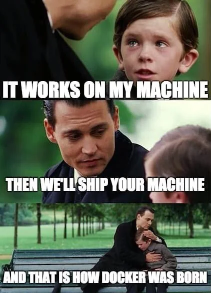

# Install Docker

We will use Docker to provide the development environment that we will use throughout this course.
Among other benefits, this will ensure that your development environment and our grading environment are identical.

<figure>

  

  <figcaption>Why Docker is Useful. <small>Original images © Miramax Films. Meme creator unknown.</small></figcaption>

</figure>

- [Windows](#install-docker-on-windows)
- [macOS](#install-docker-on-macos)
- [Linux](#install-docker-on-linux)
- [Verify Your Installation](#verify-your-installation)


## Install Docker on Windows

### Install Docker Desktop

- [ ] Visit https://docs.docker.com/desktop/setup/install/windows-install/.
- [ ] Download and run the Docker Desktop installer.
- [ ] Follow the installation instructions.

  > ⚠️  **Important**
  > 
  > Docker Desktop requires WSL 2 (Windows Subsystem for Linux).
  > If Docker Desktop prompts you to install or update WSL 2, follow the prompts and restart your computer if requested.

### Start Docker Desktop

- [ ] Launch Docker Desktop from the Start menu and wait for it to finish starting.

Proceed to [Verify Your Installation](#verify-your-installation)


## Install Docker on macOS

### Install Docker Desktop

- [ ] Visit https://docs.docker.com/desktop/setup/install/mac-install/.
- [ ] Download Docker Desktop for your Mac.
- [ ] Follow the installation instructions.

### Start Docker Desktop

- [ ] Launch Docker Desktop and wait for it to finish starting.

Proceed to [Verify Your Installation](#verify-your-installation)


## Install Docker on Linux

### Install Either Docker Engine or Docker Desktop

There are two ways to run Docker on a Linux System.

#### Docker Engine with the Docker Compose plugin

Docker Engine is the traditional way to run Docker on Linux

Why you would be happy with Docker Engine:
- Uses fewer system resources
- The daemon is normally started automatically by systemd
- Fully [open-source](https://github.com/moby/moby/blob/master/LICENSE), if that matters to you

If you decide that Docker Engine is for you:
- [ ] Follow the instructions to install Docker Engine for your Linux distribution:
  https://docs.docker.com/engine/install/.
- [ ] Follow the instructions to install the Docker Compose plugin for your Linux distribution:
  https://docs.docker.com/compose/install/linux/

#### Docker Desktop

Docker Desktop provides the Docker command-line tools, along with a graphical interface and several additional features.

Why you would be happy with Docker Desktop:
- Installs all of the Docker features that we'll use in this course 
- Simplifies emulating other platforms if you decide to work with multi-platform containers (you won't need to in this course)

If you decide that Docker Desktop is for you:
- [ ] To install Docker Desktop, follow the instructions for your Linux distribution:
  https://docs.docker.com/desktop/setup/install/linux/.


## Verify Your Installation

- [ ] Open a terminal window and run:
  ```bash
  docker --version
  ```
  You should see output similar to:
  ```text
  Docker version ..., build ...
  ```
- [ ] Verify that Docker can start a container:
  ```bash
  docker run hello-world
  ```
  Docker will probably need to download the "hello-world" image.
  You may be prompted to allow this to happen.
  After the "hello-world" image has been downloaded, you should see a message beginning with:
  ```text
  Hello from Docker!
  ```

If either command fails, consult the troubleshooting guide or ask a TA for help.
