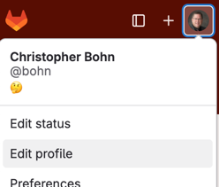

# Git Configuration

## Prepare an SSH keypair

If you have not already prepared an SSH keypair to authenticate with git.unl.edu from nuros.unl.edu:
- [ ] Log into nuros.unl.edu using a secure shell terminal (see the [discussion below](#the-development-environment))
- [ ] Run the command
  ```
  ssh-keygen -t rsa -b 4096 -C "CSCE 231"
  ```
  When asked what file to save it in, press ENTER to accept the default.  
  When prompted for a passphrase, you may set one up, or you can press ENTER to use no passphrase.
- [ ] Run the command
  ```
  cat ~/.ssh/id_rsa.pub
  ```
- [ ] Highlight the output, and copy it to your computer's clipboard.
- [ ] In git.unl.edu's web interface, click on your avatar to get a drop-down menu, and select "Edit profile" (alternatively, from your account page, there is an "Edit profile" in the upper-right corner)  
  
- [ ] In the left-side menu, select "SSH Keys".
- [ ] Paste the public key that you copied into the "Key" field, and click "Add key"


## Configure your Git identity

If you have not already configured your Git identity on nuros.unl.edu:
- [ ] Run these commands:
  ```
  git config --global user.name "YOUR HUMAN NAME"
  git config --global user.email "USERNAME@huskers.unl.edu"
  ```
  Where *YOUR HUMAN NAME* is your name, such as *Stuart Dent*, and *USERNAME* is your huskers.unl.edu username.

