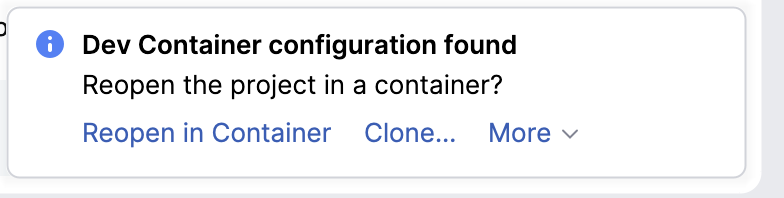
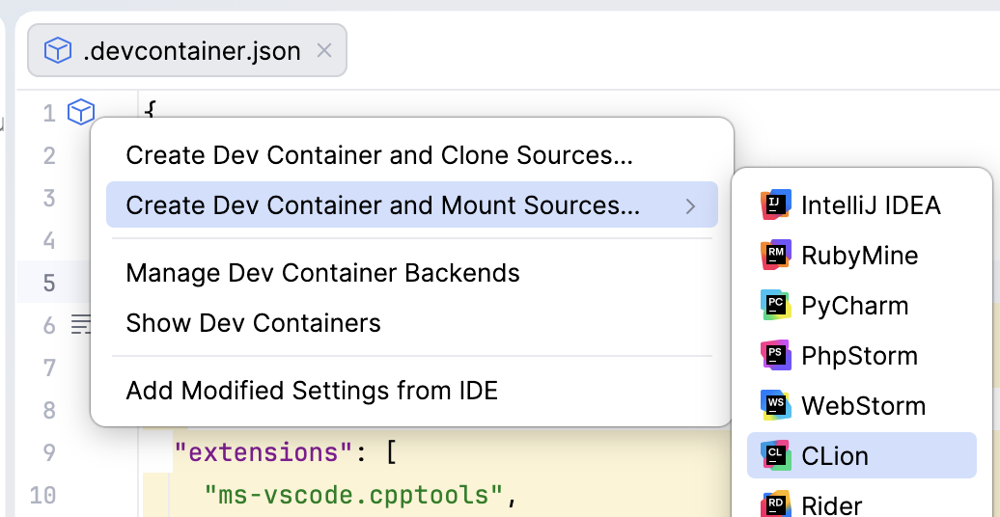
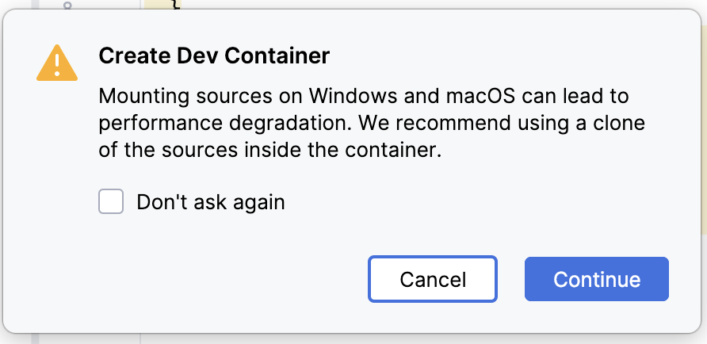
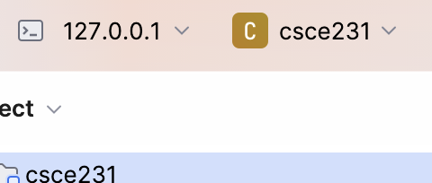

# Accessing the Development Container using CLion

Either:
- [ ] Open CLion and click on the Welcome window's **Open** button to navigate to the top level of your repository.
Or:
- [ ] Open a terminal window and use `cd` to navigate to the top level of your repository, then launch CLion:
  ```bash
  clion .
  ```

CLion will detect the `.devcontainer.json` file, and a pop-up notification will appear in the lower-right corner, asking if you want to reopen the project in a container:

> 

- [ ] Click the "Reopen in Container" link.

If the pop-up notification disappears before you can click on the button, then:
- [ ] Open the `.devcontainer.json` file.
- [ ] Click on the box-shaped container icon in the left gutter.
- [ ] Select **Create Dev Container and Mount Sources...** ⇒ **CLion**

> 

You may see a popup recommending a clone of the sources instead of mounting sources.

> 

If you see that popup, click the "Continue" button.
We intentionally use **Mount Sources** because it allows your host computer and all container instances to work with the same copy of your repository.

After a moment, the CLion window will close, and a new CLion window that is connected to the development container will open.


## How to verify that you're in the container

You can confirm that you're in the container by looking at the top of CLion.

It will show that CLion is "remotely" connected to 127.0.0.1.

> 


## How to exit the container

When you are finished working inside the container:
- [ ] Close the CLion window.
- [ ] When prompted **Stop the IDE Backend or Keep It Running**, click on "Close and Stop".

This closes the container, and a new CLion window will open in your repository on your computer.
