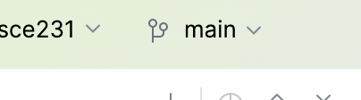
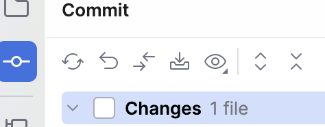
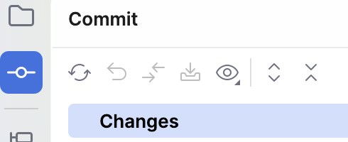
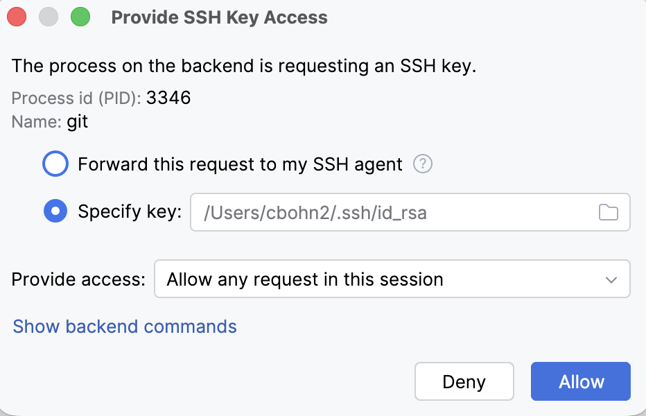
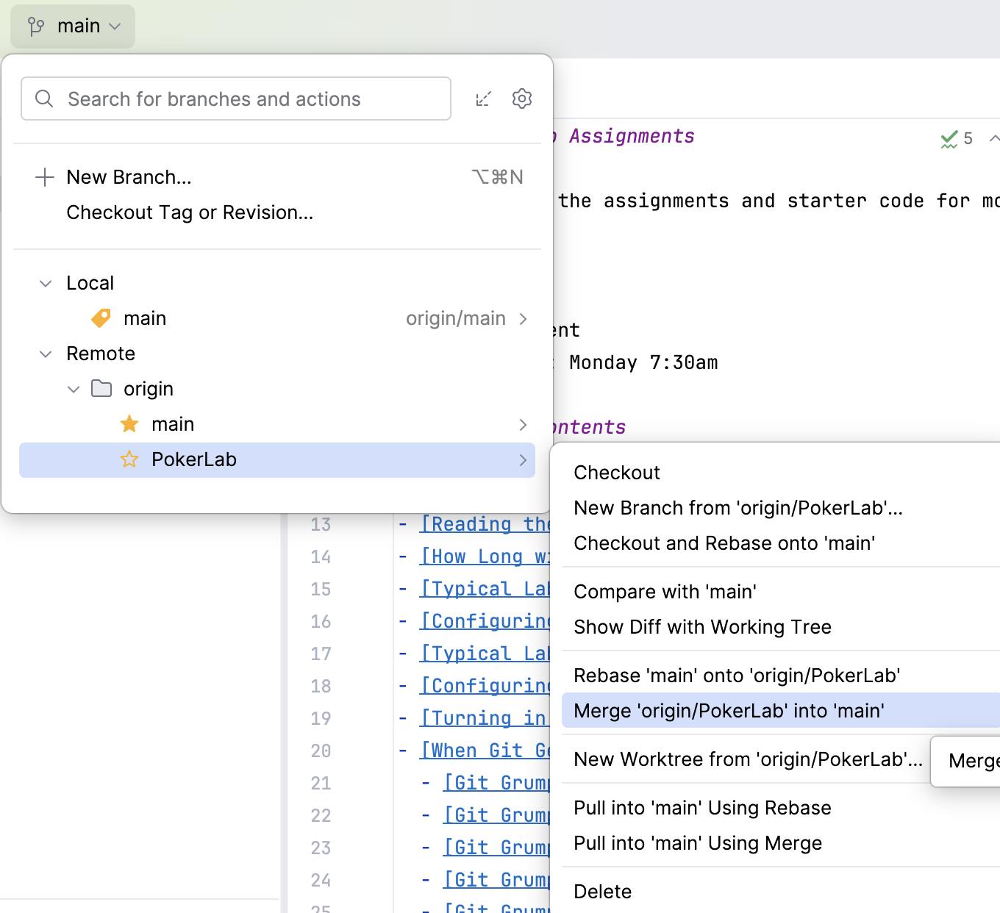
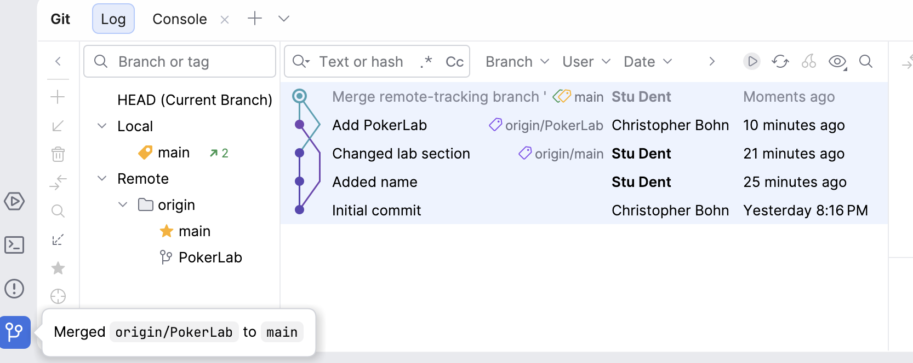
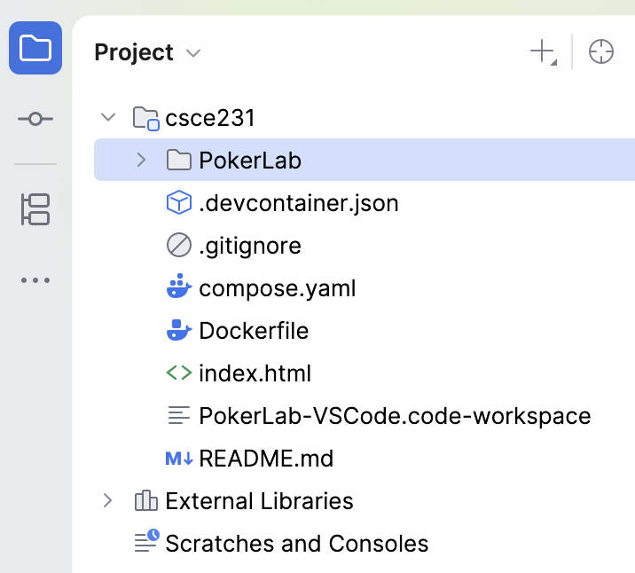

# Retrieving the Lab using CLion

We will place each coding assignment in a non-`main` branch so that adding a new assignment does not interfere with the assignment you're working on.
When you are ready to work on a coding assignment, notionally *FooLab*, you can retrieve the assignment from the Git server and merge it into your `main` branch:

## Prepare to Retrieve the Updates

- [ ] First, make sure you are on the `main` branch.
  You will find the current branch at the top of CLion's window.
  > 

- [ ] And make sure that you have committed any changes from your current work, so that your repository is ready to receive the *FooLab*.
  If the Commit view shows that there are changed files, then you have uncommitted changes.
  > 

  If the Commit view doesn't show any changed files, then all of your changes have been committed.
  > 
  

## Fetch the Updates

- [ ] Next, retrieve the latest branches from the remote copy of your repository.
  From CLion's menu, select **Git** ⇒ **Fetch**

> ⓘ **Note**
>
> The first time that CLion access the Git server during a session, you may be prompted to approve SSH Key Access.
> If you are:
> - [ ] Click the "Allow" button
>
> > 

- [ ] Confirm that you successfully fetched *FooLab*'s branch.
  Click on the current branch dropdown at the top of CLion's window.
  The list of current branches will appear.
  You should see `Remote` ⇒ `origin` ⇒ `FooLab` in the list of branches.
  > 

If you do not see `origin/FooLab`, look at [the `git fetch` troubleshooting steps](../../troubleshooting/git.md#git-grumpiness-git-fetch).

## Merge the Updates into `main`

Finally, merge the *FooLab* branch into your `main` branch.
- [ ] In the current branch dropdown, select **FooLab** ⇒ **Merge 'origin/FooLab' into 'main'**
  > 

Confirm that you successfully merged `origin/FooLab` into `main`.
There are two indicators.
- [ ] The Git view will show a visual representation of the merge. 
  > 
- [ ] The Project view will include the *FooLab* directory.
  > 

If the merge was not successful, look at [the `git merge` troubleshooting steps](../../troubleshooting/git.md#git-grumpiness-git-merge).
