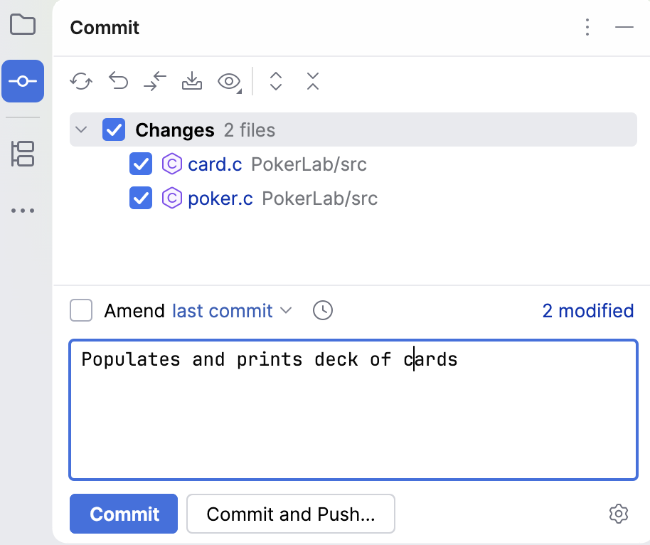
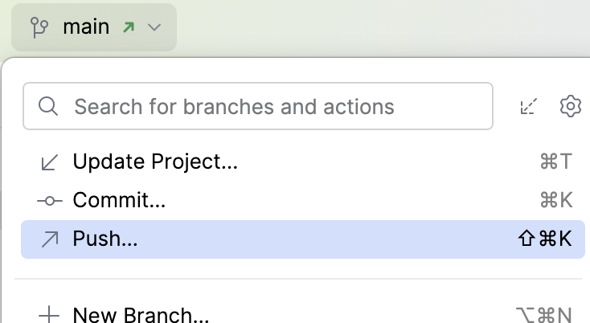

# Turning in the Completed Lab using CLion

Some parts of some labs require you to provide answers on Canvas.
Be sure to have those completed before the assignment is due.

You turn in the code by pushing your completed lab to your Git repository.
You *should* make a habit of committing successful changes along the way, but at a minimum, push your completed code before the assignment is due.

> ⓘ **Note**
> 
> If you are exercising one or more late days, worked with a lab partner, or consulted external references, 
> then update `submission_metadata.json` before committing and pushing your work.

In the Commit view, you will see a list of changed files under "Changes".
- [ ] Check the box next to "Changes" to select all changes.
  > ⓘ **Note**
  > 
  > You can individually select files to be staged (just as you can individually list files with `git add`) but you most likely will want to simply stage all changes.
- [ ] Type a descriptive commit message in the "Message" text box and press the "Commit" button.
  (Unlike the terminal workflow, CLion stages the selected files and creates the commit in a single step.)
  > 

  > ⓘ **Note**
  >
  > The message box supports multi-line commit messages if you wish to provide a more detailed description of your changes.

The changes are now ready to be sent to git.unl.edu:
- [ ] In the current branch dropdown, select **↗ Push...**
  > 
- [ ] A confirmation window will pop up. Click on the "Push" button.

- [ ] Refresh your repository in your web browser and confirm that your most recent commit appears and that the files you changed contain your latest work.

Once your changes have been pushed to the Git server, no further action is required unless the assignment also includes questions to be answered on Canvas.
