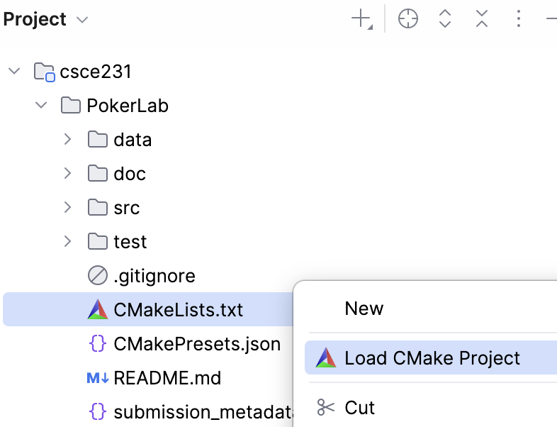
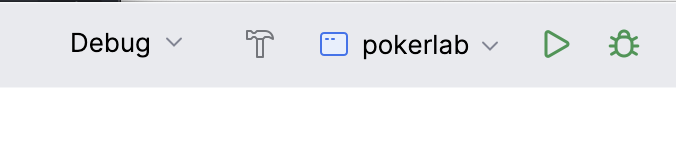
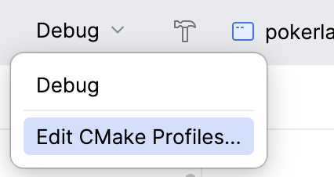
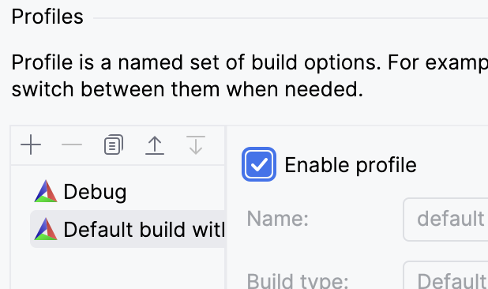
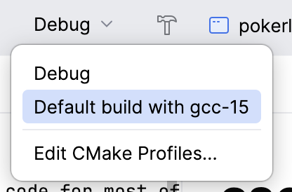
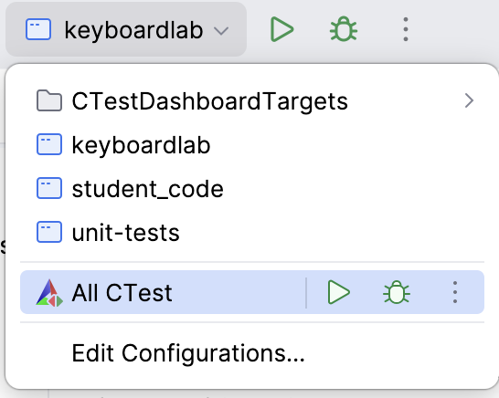

# Working on the Lab using CLion

These instructions assume that you have already [started the development container](accessing-the-container.md).

- Linux-Native Code
    - [Configuring the Project](#configuring-compiling-running-and-testing-linux-native-code)
    - [Compiling the Project](#compiling-the-project-linux-native-code)
    - [Running the Program](#running-the-program-linux-native-code)
    - [Testing the Program](#testing-the-program-linux-native-code)
- Cow Pi Code
    - [Configuring the Project](#configuring-the-project-cow-pi-code)
    - [Compiling the Project](#compiling-the-project-cow-pi-code)
    - [Uploading the Program](#uploading-the-program-to-the-cow-pi-board-cow-pi-code)

## Configuring, Compiling, Running, and Testing (Linux-Native Code)

### Configuring the Project (Linux-Native Code)

You normally only need to configure the project once.

- [ ] In the Project view, expand the *FooLab* directory.
- [ ] Right-click on the *CMakeLists.txt* file in the *FooLab* directory.
- [ ] Select **Load CMake Project**.
  > 

The Project view will be unchanged, but CLion will configure itself to work on *FooLab*.
You can confirm this by looking at the configuration bar at the top of the CLion window.
The Run/Debug Configurations drop-down will show one of the assignment's execution targets. 

> 

#### Optional Step: Load the CMake Preset

If you do not perform this optional step, CLion will use its built-in "Debug" profile.
For this semester's assignments, CLion's built-in "Debug" profile and the profile in *CMakePresets.json* should behave the same.
However, if you perform some actions in CLion and other actions in a terminal window, you may see some unexpected behavior if CLion uses its own profile and your terminal actions use the profile defined in *CMakePresets.json*.

To make CLion use the profile defined in *CMakePresets.json*:

- [ ] Click on the Profiles drop-down (which is currently labeled "Debug").
- [ ] Select **Edit CMake Profiles...**
  > 

In the resulting window:
- [ ] Select **Default build with gcc-15**.
- [ ] Check **Enable profile**.
  > 
- [ ] Click "OK"

- [ ] Click on the Profiles drop-down again.
- [ ] Select **Default build with gcc-15**.
  > 

### Compiling the Project (Linux-Native Code)

In CLion's configuration bar, you will see buttons to build the project, debug the project, and run the project.

> 

- [ ] Click the "🔨" (Build) button.

Build messages, including compiler warnings and errors, will display in the Messages view.

### Running the Program (Linux-Native Code)

In CLion's configuration bar, you will see buttons to build the project, debug the project, and run the project.

> 

- [ ] If the project contains more than one executable file, use the Run/Debug Configurations drop-down menu to select the execution target you wish to run.

To run the program:
- [ ] Click the "▶" (Run) button.

To debug the program in an interactive debugger:
- [ ] Click the "🪲" (Debug) button.

### Testing the Program (Linux-Native Code)

[//]: # (TODO)

We expect you to test your own code.
Most labs' driver code is designed to facilitate this: provide your inputs, and the driver code will show you the actual output and compare it with the expected output.
We also provide automated tests that correspond to any examples in the assignment's instructions.

Further, most labs have particular constraints that require you to write your code in a way that will help you attain the learning objectives.
We provide an automated test that checks for violations of the assignment's constraints.

- [ ] Use the Run/Debug Configuration drop-down menu to select **All CTest**.
- [ ] Click the "▶" (Run) button or "🪲" (Debug) button.
  - From the kebab menu, you can also choose to run tests with coverage.
  > 

In the "All CTest" tab in the Run view, you can see the test results and rerun all or only some tests.
> 

## Configuring, Compiling, and Uploading (Cow Pi Code)

### Configuring the Project (Cow Pi Code)

[//]: # (TODO: confirm that "load platformio.ini" will work for this, too -- it should, but I need to confirm it)

### Compiling the Project (Cow Pi Code)

[//]: # (TODO: copy from Hardware Prelabs)

### Uploading the Program to the Cow Pi Board (Cow Pi Code)

- [ ] Open a file browser on your host computer and navigate to the *FooLab* directory.
- [ ] Prepare the Cow Pi to receive the program.
  1. Press the RESET button on the Cow Pi
  2. While still pressing the RESET button, press the BOOTSEL button on the Cow Pi
  3. Release the RESET button
  4. Release the BOOTSEL button
    - This will present the microcontroller's flash memory to your computer as a USB mass storage device.
- [ ] Drag & drop the .uf2 file from the *FooLab/build* directory to the USB mass storage device.
  - After the upload has finished, the USB mass storage device will disconnect.

[//]: # (TODO: confirm that drag & drop can be done from CLion's project view)
