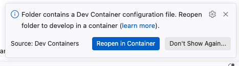

# Accessing the Development Container using VS Code

Either:
- [ ] Open VS Code and use **File** ⇒ **Open...** to navigate to the top level of your repository.
Or:
- [ ] Open a terminal window and use `cd` to navigate to the top level of your repository, then open the repository VS Code:
  ```bash
  code .
  ```

VS Code will detect the `.devcontainer.json` file, and a pop-up notification will appear in the lower-right corner, asking if you want to reopen the folder in a container:

> 

- [ ] Click the "Reopen in Container" button.

> ❗️ **Important**
> 
> If VS Code detects one or more workspace files, **do not open one yet**.
> First open the repository in the development container.
> Once the container is running, and after you have retrieved the current lab, you can open the appropriate workspace for the current lab.

If the pop-up notification disappears before you can click on the button, then:
- [ ] Open the Command Palette, and
- [ ] Run **Dev Containers: Reopen in Container**


After a moment, VS Code will re-open your repository directory inside a container.


## How to verify that you're in the container

You can confirm that you're in the container by looking at the lower-left corner of VS Code.

It will highlight that the VS Code is connected to the development container.

> 


## How to exit the container

When you are finished working inside the container:
- [ ] Open the Command Palette, and
- [ ] Run **Dev Containers: Reopen Folder Locally**

This closes the container and reopens your repository on your computer.
