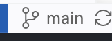
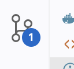
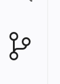
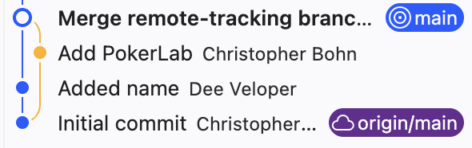
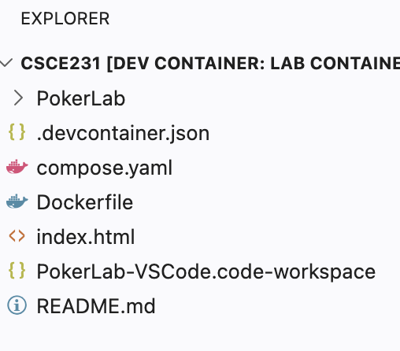

# Retrieving the Lab using VS Code

We will place each coding assignment in a non-`main` branch so that adding a new assignment does not interfere with the assignment you're working on.
When you are ready to work on a coding assignment, notionally *FooLab*, you can retrieve the assignment from the Git server and merge it into your `main` branch:

## Prepare to Retrieve the Updates

- [ ] First, make sure you are on the `main` branch.
  You will find the current branch in the Status Bar at the bottom of VS Code.
  > 

- [ ] And make sure that you have committed any changes from your current work, so that your repository is ready to receive the *FooLab*.
  If the source control icon on the Activity Bar has a number, then you have uncommitted changes.
  > 

  If it doesn't have a number, then all of your changes have been committed.
  > 
  

## Fetch the Updates

- [ ] Next, retrieve the latest branches from the remote copy of your repository.
  Open the Command Palette and run **Git: Fetch**

- [ ] Confirm that you successfully fetched *FooLab*'s branch.
  Click on the Git status bar at the bottom of VS Code.
  The list of current branches will appear.
  You should see `origin/FooLab` in the list of branches.
  > 

If you do not see `origin/FooLab`, look at [the `git fetch` troubleshooting steps](../../troubleshooting/git.md#git-grumpiness-git-fetch).

## Merge the Updates into `main`

Finally, merge the *FooLab* branch into your `main` branch.
- [ ] Make sure the branch shown in the Status Bar is still `main` before performing the merge.
- [ ] Open the Command Palette and run **Git: Merge**
  You will be presented with a list of unmerged branches.
- [ ] Select the `origin/FooLab` branch.  

Confirm that you successfully merged `origin/FooLab` into `main`.
There are two indicators.
- [ ] In the Source Control view, the **graph** will show a visual representation of the merge. 
  > 
- [ ] In the Explorer view, the list of files and directories will include the *FooLab* directory and the *FooLab-VSCode.code-workspace* file.
  > 

If the merge was not successful, look at [the `git merge` troubleshooting steps](../../troubleshooting/git.md#git-grumpiness-git-merge).
