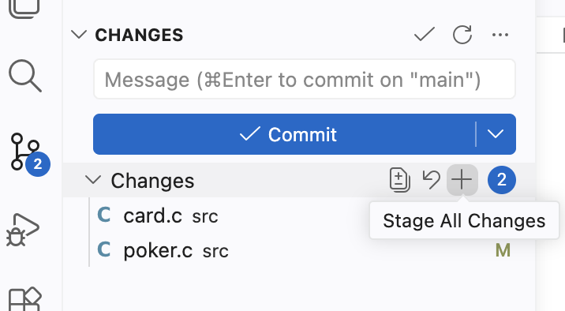
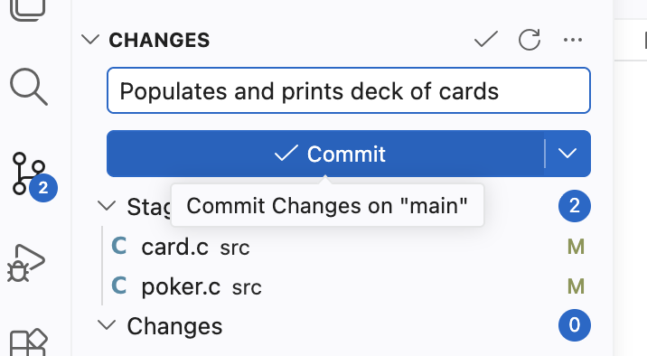
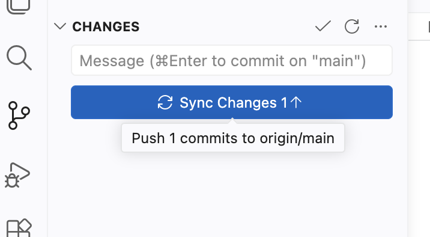

# Turning in the Completed Lab using VS Code

Some parts of some labs require you to provide answers on Canvas.
Be sure to have those completed before the assignment is due.

You turn in the code by pushing your completed lab to your Git repository.
You *should* make a habit of committing successful changes along the way, but at a minimum, push your completed code before the assignment is due.

> ⓘ **Note**
> 
> If you are exercising one or more late days, worked with a lab partner, or consulted external references, 
> then update `submission_metadata.json` before committing and pushing your work.

In the Source Control view, you will see a list of changed files under "Changes".
- [ ] Hover your mouse over "Changes" until a `+` icon appears.
  > 
- [ ] Click on the `+` icon to stage all changes.
  (This is equivalent to `git add .`.)

  > ⓘ **Note**
  > 
  > You can individually select files to be staged (just as you can individually list files with `git add`) but you most likely will want to simply stage all changes.

The changed files will now be listed as "Staged Changes".
- [ ] Type a descriptive commit message in the "Message" text field and press the "Commit" button.
  (This is equivalent to `git commit -m "..."`.)
  > 

  > ⓘ **Note**
  >
  > If you omit the commit message, then an Editor tab will open for you to provide a commit message (equivalent to `git commit` without the `-m` argument).

The changes are now ready to be sent to git.unl.edu:
- [ ] Press the "Sync Changes" button.
  (This uses both `git push` and `git pull` to synchronize your local repository with the Git server.)
  > 
  
- [ ] Refresh your repository in your web browser and confirm that your most recent commit appears and that the files you changed contain your latest work.

Once your changes have been pushed to the Git server, no further action is required unless the assignment also includes questions to be answered on Canvas.
