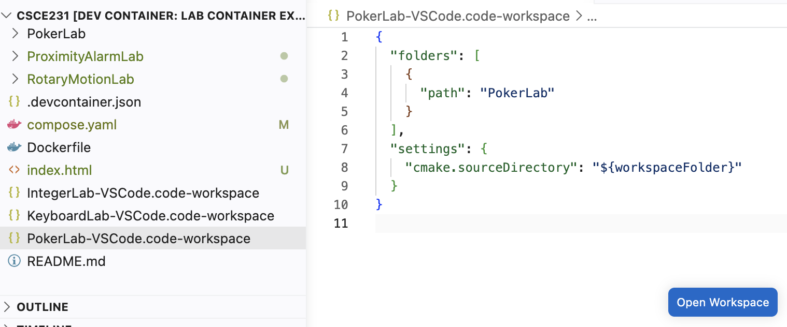
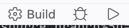

# Working on the Lab using VS Code

These instructions assume that you have already [started the development container](accessing-the-container.md).

- Linux-Native Code
    - [Configuring the Project](#configuring-compiling-running-and-testing-linux-native-code)
    - [Compiling the Project](#compiling-the-project-linux-native-code)
    - [Running the Program](#running-the-program-linux-native-code)
    - [Testing the Program](#testing-the-program-linux-native-code)
- Cow Pi Code
    - [Configuring the Project](#configuring-the-project-cow-pi-code)
    - [Compiling the Project](#compiling-the-project-cow-pi-code)
    - [Uploading the Program](#uploading-the-program-to-the-cow-pi-board-cow-pi-code)

## Configuring, Compiling, Running, and Testing (Linux-Native Code)

### Configuring the Project (Linux-Native Code)

You normally only need to configure the project once.

- [ ] In the Explorer view, click on the *FooLab-VSCode.code-workspace* file.
  The file will open in an Editor tab, and an "Open Workspace" button will appear in the Editor tab.
  > 
- [ ] Click on the "Open Workspace" button.

VS Code will re-load, still connected to the development container, with *FooLab* as the workspace the root.
VS Code will then process the *CMakePresets.json* and *CMakeLists.txt* files and configure the project for you.

### Compiling the Project (Linux-Native Code)

In VS Code's Status Bar, you will see buttons to build the project, debug the project, and run the project.

> 

- [ ] Click the `⚙️ Build` button.

Build messages, including compiler warnings and errors, will display in the `Output` tab, and anything that generated a warning or error will also be displayed in the `Problems` tab.

### Running the Program (Linux-Native Code)

In VS Code's Status Bar, you will see buttons to build the project, debug the project, and run the project.

> 

To run the program:
- [ ] Click the "▶" (Run) button.
  If the project contains more than one executable file, you will be presented with a list of possible execution targets.
  Select the one you wish to run.

To debug the program in an interactive debugger:
- [ ] Click the "🪲" (Debug) button.
  If the project contains more than one executable file, you will be presented with a list of possible execution targets.
  Select the one you wish to run.

### Testing the Program (Linux-Native Code)

We expect you to test your own code.
Most labs' driver code is designed to facilitate this: provide your inputs, and the driver code will show you the actual output and compare it with the expected output.
We also provide automated tests that correspond to any examples in the assignment's instructions.

Further, most labs have particular constraints that require you to write your code in a way that will help you attain the learning objectives.
We provide an automated test that checks for violations of the assignment's constraints.

- [ ] Click on the beaker icon on the Activity Bar to open the Testing view.

In the testing view, you can run tests, debug tests, and run tests with coverage.
You can also choose to run all tests or only some tests.
> 

## Configuring, Compiling, and Uploading (Cow Pi Code)

### Configuring the Project (Cow Pi Code)

[//]: # (TODO: confirm that a code-workspace file will work for this, too -- it should, but I need to confirm it)

### Compiling the Project (Cow Pi Code)

[//]: # (TODO: copy from Hardware Prelabs)

### Uploading the Program to the Cow Pi Board (Cow Pi Code)

- [ ] Open a file browser on your host computer and navigate to the *FooLab* directory.
- [ ] Prepare the Cow Pi to receive the program.
  1. Press the RESET button on the Cow Pi
  2. While still pressing the RESET button, press the BOOTSEL button on the Cow Pi
  3. Release the RESET button
  4. Release the BOOTSEL button
    - This will present the microcontroller's flash memory to your computer as a USB mass storage device.
- [ ] Drag & drop the .uf2 file from the *FooLab/build* directory to the USB mass storage device.
  - After the upload has finished, the USB mass storage device will disconnect.

[//]: # (TODO: confirm that drag & drop can be done from VS Code's file explorer)

[//]: # (TODO: should we explain why the upload button won't work from within the container, simply state that it won't work, or simply state that we won't use it this semester? )
[//]: # (TODO: double-check: maybe we can use the upload button &#40;except on Windows -- Windows USB drivers suck&#41; -- if so, then we'll go with "we won't use it")